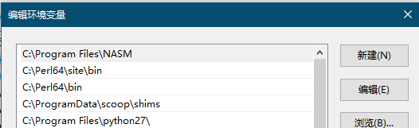
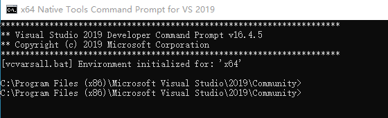
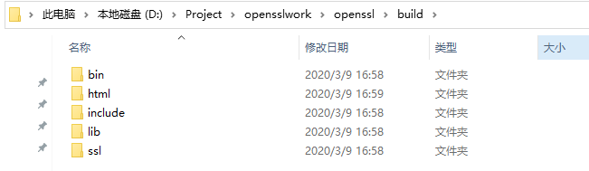
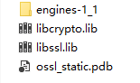
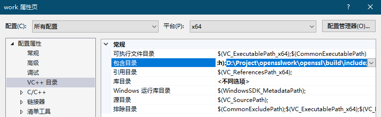
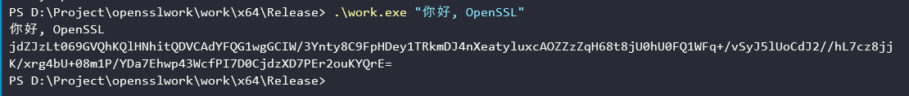
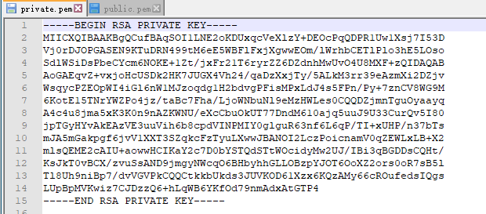
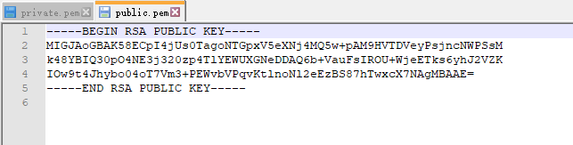

## 简介

目标平台： Windows 10 amd64

使用静态链接方式，原因：动态链接库太大了，包含很多本次实验不需要的函数

## 准备工作

### 下载openssl代码

`git clone https://github.com/openssl/openssl.git`

或者从官网 https://www.openssl.org/source/ 下载源代码

我使用的是openssl 1.1.1

### 安装perl环境，这里使用的是ActivePerl

https://www.activestate.com/products/perl/

### 安装NASM汇编器

https://www.nasm.us/

### 配置环境变量

将刚刚安装的nasm和perl的bin目录加入PATH



## 编译 openssl 静态链接库

### 初始化环境

使用visual studio自带的命令提示工具初始化环境，因为需要使用nmake




### 生成编译配置文件

cd进入openssl源码目录

执行 ```perl Configure VC-WIN64A no-asm no-shared --prefix="D:\Project\opensslwork\openssl\build" --openssldir="D:\Project\opensslwork\openssl\build\ssl"```

### 进行编译并测试和安装

```shell
nmake
nmake test
nmake install
```

此时已经有了我们需要的头文件和静态链接lib库





## 使用openssl的api进行编程

### visual studio项目配置

vs创建空项目，然后配置头文件和库文件的路径

项目右键-属性，配置选择所有配置，平台选择x64

`VC++ 目录` 配置里面的 `包含目录` 添加openssl的头文件目录, 我这里是 `D:\Project\opensslwork\openssl\build\include;`



`链接器` 里面的 `输入` 的 `附加依赖项` 添加 静态库名，`libcrypto.lib;libssl.lib;`

> 注意：在使用openssl的静态链接库时，除了添加 `libcrypto.lib;libssl.lib;`，还需要添加系统的依赖库：`crypt32.lib;WS2_32.lib;`， 因为openssl在windows平台使用了这些库。
> 完整的： `kernel32.lib;user32.lib;gdi32.lib;winspool.lib;comdlg32.lib;advapi32.lib;shell32.lib;ole32.lib;oleaut32.lib;uuid.lib;odbc32.lib;odbccp32.lib;%(AdditionalDependencies);crypt32.lib;libcrypto.lib;libssl.lib;WS2_32.lib;`

### 添加头文件

因为需要md5,rsa,base64等操作，这里需要导入openssl四个相关的头文件

```c++
#include <openssl/rsa.h>
#include <openssl/pem.h>
#include <openssl/md5.h>
#include <openssl/bio.h>
```

### 使用MD5对字符串生成摘要

```c++
int md5_hash(const char *in, unsigned char *md)
{
    unsigned char* data;
    const unsigned char* str;
    data = (unsigned char*)in;
    MD5(data, strlen(in), md); //调用openssl的md5方法
    return 1;
}
```

### 生成rsa密钥对并以pem格式写入文件

```c++
RSA * gen_rsa()
{
    int bits = 1024;
    RSA* rsa = RSA_new();
    BIGNUM* e = BN_new();
    BN_set_word(e, RSA_F4);
    int rc = RSA_generate_key_ex(rsa, bits, e, NULL); //openssl中生成rsa key的新方法
    BN_free(e);
    if (rc != 1) return NULL;   
    size_t pri_len;
    size_t pub_len;
    char* pri_key = NULL;
    char* pub_key = NULL;
    BIO* pubkey = BIO_new_file("public.pem", "w");
    BIO* prikey = BIO_new_file("private.pem", "w");
    PEM_write_bio_RSAPrivateKey(prikey, rsa, NULL, NULL, 0, NULL, NULL); //私钥写入文件
    PEM_write_bio_RSAPublicKey(pubkey, rsa); //公钥写入文件
    return rsa;
}
```

### 对数据进行base64编码，base64在BIO中有

```c++
int base64_encode(const unsigned char* buffer, size_t length, char** b64text) {
    BIO* bio, * b64;
    BUF_MEM* bufferPtr;
    b64 = BIO_new(BIO_f_base64());
    bio = BIO_new(BIO_s_mem());
    bio = BIO_push(b64, bio);
    BIO_set_flags(bio, BIO_FLAGS_BASE64_NO_NL);
    BIO_write(bio, buffer, length);
    BIO_flush(bio);
    BIO_get_mem_ptr(bio, &bufferPtr);
    BIO_set_close(bio, BIO_NOCLOSE);
    *b64text = (char*)malloc((bufferPtr->length + 1) * sizeof(char));
    memcpy(*b64text, bufferPtr->data, bufferPtr->length);
    (*b64text)[bufferPtr->length] = '\0';
    BIO_free_all(bio);
    return 0;
}
```

### 最后通过main函数读入字符串并将三个过程连起来

```c++
int main(int argc, char* argv[])
{
    if (argc < 2)
    {
        printf("usage: work.exe \"string to hash and sign\"");
        return 0;
    }
    char* str = argv[1];
    printf("your str: %s\n", str);

    // first md5(str)
    unsigned char md[MD5_DIGEST_LENGTH];
    md5_hash(str, md);

    // then gen rsa pkey and sign the md
    RSA* rsa = gen_rsa();
    unsigned char* sig = new unsigned char;
    unsigned int siglen;
    RSA_sign(NID_sha1, md, MD5_DIGEST_LENGTH, sig, &siglen, rsa);

    // final base64(sig)
    char* b64text;
    base64_encode(sig, (size_t)siglen, &b64text);
    printf("%s\n", b64text);
    return 0;
}
```

> 因为是课程作业，就没有对出现的错误情况进行处理，实际使用时需要考虑到

## 运行

### 运行截图



### 生成的私钥文件



### 生成的公钥文件


