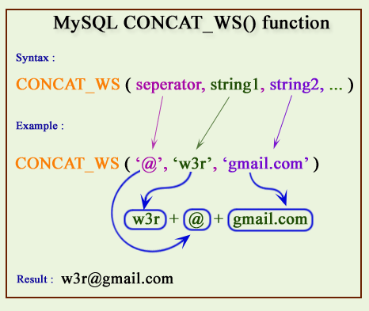
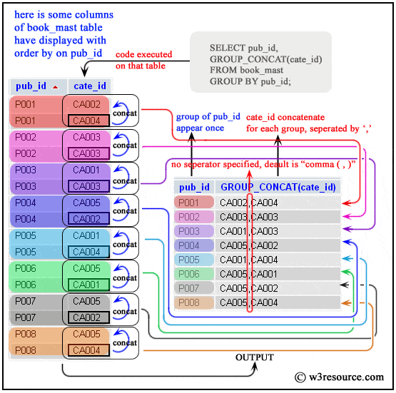

## 讲解与示例

### CONCAT(str1, str2, ...)

1. 返回结果为连接参数产生的字符串。如有任何一个参数为NULL ，则返回值为 NULL
2. 参数可以是字段名或具体值

注意：

1. 如果所有参数均为非二进制字符串，则结果为非二进制字符串
2. 如果自变量中含有任一二进制字符串，则结果为一个二进制字符串
3. 一个数字参数被转化为与之相等的二进制字符串格式
4. 若要避免这种情况，可使用显式类型 cast, 例如： `SELECT CONCAT(CAST(int_col AS CHAR), char_col)`

#### MySQL的concat函数可以连接一个或者多个字符串

```bash
mysql> select concat('10');
+--------------+
| concat('10') |
+--------------+
| 10   |
+--------------+
1 row in set (0.00 sec)
mysql> select concat('11','22','33');
+------------------------+
| concat('11','22','33') |
+------------------------+
| 112233 |
+------------------------+
1 row in set (0.00 sec)
```

#### MySQL的concat函数在连接字符串的时候，只要其中一个是NULL,那么将返回NULL

```bash
mysql> select concat('11','22',null);
+------------------------+
| concat('11','22',null) |
+------------------------+
| NULL   |
+------------------------+
1 row in set (0.00 sec)
```

### CONCAT_WS(separator,str1,str2,…)

CONCAT_WS() 代表 CONCAT With Separator ，是CONCAT()的特殊形式。第一个参数是其它参数的分隔符。分隔符的位置放在要连接的两个字符串之间。分隔符可以是一个字符串，也可以是其它参数。

注意：

1. 参数可以是字段名或具体值
2. 如果分隔符为 NULL，则结果为 NULL。函数会忽略任何分隔符参数后的 NULL 值。（只保留非空值）

```bash
mysql> select concat_ws('','','','33');
+--------------------------+
| concat_ws('','','','33') |
+--------------------------+
| 33                       |
+--------------------------+
1 row in set (0.04 sec)
```

#### 如连接后以逗号分隔

```bash
mysql> select concat_ws(',','11','22','33');
+-------------------------------+
| concat_ws(',','11','22','33') |
+-------------------------------+
| 11,22,33 |
+-------------------------------+
1 row in set (0.00 sec)
```

#### 和MySQL中concat函数不同的是, concat_ws函数在执行的时候,不会因为NULL值而返回NULL

```bash
mysql> select concat_ws(',','11','22',NULL);
+-------------------------------+
| concat_ws(',','11','22',NULL) |
+-------------------------------+
| 11,22 |
+-------------------------------+
1 row in set (0.00 sec)
```

### GROUP_CONCAT() 函数

```sql
group_concat([DISTINCT] 要连接的字段 [Order BY ASC/DESC 排序字段] [Separator ‘分隔符’])
```

#### 基本查询

```bash
mysql> select * from aa;
+------+------+
| id| name |
+------+------+
|1 | 10|
|1 | 20|
|1 | 20|
|2 | 20|
|3 | 200   |
|3 | 500   |
+------+------+
6 rows in set (0.00 sec)
```

#### 以id分组，把name字段的值打印在一行，逗号分隔(默认)

```bash
mysql> select id,group_concat(name) from aa group by id;
+------+--------------------+
| id| group_concat(name) |
+------+--------------------+
|1 | 10,20,20|
|2 | 20 |
|3 | 200,500|
+------+--------------------+
3 rows in set (0.00 sec)
```

#### 以id分组，把去冗余的name字段的值打印在一行，逗号分隔

```bash
mysql> select id,group_concat(distinct name) from aa group by id;
+------+-----------------------------+
| id| group_concat(distinct name) |
+------+-----------------------------+
|1 | 10,20|
|2 | 20   |
|3 | 200,500 |
+------+-----------------------------+
3 rows in set (0.00 sec)
```

#### 以id分组，把name字段的值打印在一行，逗号分隔，以name排倒序

```bash
mysql> select id,group_concat(name order by name desc) from aa group by id;
+------+---------------------------------------+
| id| group_concat(name order by name desc) |
+------+---------------------------------------+
|1 | 20,20,10   |
|2 | 20|
|3 | 500,200|
+------+---------------------------------------+
3 rows in set (0.00 sec)
```

## 区别

https://stackoverflow.com/questions/11889391/difference-between-group-concat-and-concat-ws

### concat_ws

http://www.w3resource.com/mysql/string-functions/mysql-concat_ws-function.php



### group_concat

http://www.w3resource.com/mysql/aggregate-functions-and-grouping/aggregate-functions-and-grouping-group_concat.php


