记得大一刚入学时，免费的校园网是上下行对等的100Mbps带宽，虽然赶不上家里的速度，但是用起来还是比较舒服的

万万没想到，当别的学校都在忙着升级成千兆网络的时候，自己学校竟然来了个反向操作，30Mbps限速，真TMD鬼，不知道怎么想的

这垃圾校园网，我是忍不了了，考虑到每个人都能多个设备同时登录，肯定就有多拨的可能，那就搞起来！

## Linux下手工操作

本着学习的态度，上来肯定要先在Linux下手动操作一遍（其实我是先用iKuai验证可行后，才尝试用Linux手工配的

我们的基本思路是：

1. 拿到多个IP
2. 过了学校的联网认证
3. 进行负载均衡

以下所有操作都需要root权限

### 利用macvlan获取多个IP

首先要创建多个虚拟网络接口，利用不同的Mac地址进行DHCP获取多个不同的IP地址

在Linux下，内核提供的macvlan就可以实现我们的需求，从Linux Kernel 3.9开始就支持了貌似，所以只要不是安装非常老的系统都是支持的

查看一下你的系统是否支持：

```shell
# modprobe macvlan
# lsmod | grep macvlan
macvlan                24576  0
```

如果显示类似上面的内容就表示支持

添加一个macvlan类型的网络接口：

```shell
ip link add link <physical-network-interface-name> <new-network-interface-name> type macvlan
```

例如，通过 `ip addr` 或者 `ifconfig` 查看到物理网卡名为 `eth0`，新网络接口名我们用 `vmac0` `vmac1` 这样的表示，命令如下：

```shell
ip link add link eth0 vmac0 type macvlan
ip link add link eth0 vmac1 type macvlan
```

这样就创建了两个新的网络接口，依附于物理接口 `eth0`，两个新网络接口的mac地址是自动分配的，每一次新建都会随机生成。

如果想要手动指定mac地址，可以使用下面的命令:

```shell
ip link add link <physical-network-interface-name> <new-network-interface-name> address <mac-address> type macvlan
例如：
ip link add link eth0 vmac0 address 11:22:33:44:55:66 type macvlan
```


更加详细的命令通过 `ip link help` 和 `man ip link` 查看


经过上面这一步，就就可以通过 `ip link` 看到多了两个网络接口

```shell
4: vmac0@eth0: <BROADCAST,MULTICAST> mtu 1500 qdisc noop state DOWN group default qlen 1000
    link/ether 5a:5d:f9:1e:b8:19 brd ff:ff:ff:ff:ff:ff
5: vmac1@eth0: <BROADCAST,MULTICAST> mtu 1500 qdisc noop state DOWN group default qlen 1000
    link/ether 66:50:b5:23:d8:ce brd ff:ff:ff:ff:ff:ff
```

然后需要获取到多个IP，直接执行 `dhclient` 即可

### 进行联网认证

我们学校用的是深澜的认证系统，对其认证流程分析后，写了一个小工具:[多账号登录认证工具](sdu-srun.zip)


2021年11月4日 更新

用Rust写了一个新的登录工具，更轻量更好用

https://github.com/zu1k/sdusrun


在启动前先修改配置文件，username为学号，password为上网认证的密码，ip分别写刚刚 macvlan 获取到的IP

学校限制的每个人最多5台设备同时在线，新登录的设备会把前面的设备顶下去，所以最好联合舍友用多个人的账号进行认证

```yaml
login:
 - username: 201XXXXX1
   password: user1-password
   ip: 10.0.0.1
 - username: 201XXXXX1
   password: user1-password
   ip: 10.0.0.2
 - username: 201XXXXX2
   password: user2-password
   ip: 10.0.0.3
```


认证成功后即可进行下面的步骤，如果认证失败需要检查账号密码是否正确，本工具也不能保证后续系统更新后仍能使用，必要时可登录认证后台手工添加mac认证白名单


### 进行路由级别的分流

经过上面的步骤，其实现在已经有多个可以上网的接口了，每一个接口都限速30Mbps，可以通过修改路由表验证，但是测速发现还是总速度还是30Mbps，速度并没有叠加

这其实是因为你的主机只有一个默认网关，流量实际上只走了一条线，所以还是受单接口限速的限制。我们的目的是让流量能够分别走多个接口，从而达到速度叠加的效果，也就是常说的负载均衡

思路是：通过iptables规则给数据包打上标记，然后通过策略路由根据标记来选择走哪个接口出去。需要注意不同包之间的关系，追踪连接状态并恢复标记，否则的话同一个连接的不同包走了不同的接口，会被丢弃掉。

#### 创建路由表

首先创建多个路由表，因为每一个路由表只能默认走一个接口，所以刚刚创建了多少虚拟网络接口，这里就要增加几个路由表，我按照2个接口来演示

编辑 `/etc/iproute2/rt_tables` 文件，在文件末尾增加两个路由表

```shell
# 新增的路由表
100      vmac0
101      vmac1
```

保证新路由表中没有条目，先清空一下

```shell
ip route flush table vmac0
ip route flush table vmac1
```

分别为两个路由表增加默认路由项，分别走不同的网络接口

```shell
ip route add 0/0 dev vmac0 table vmac0
ip route add 0/0 dev vmac1 table vmac1
```

#### 配置iptables

分别创建多个新的链

```shell
iptables -t mangle -N VMAC0
iptables -t mangle -A VMAC0 -j MARK --set-mark 0x100
iptables -t mangle -A VMAC0 -j CONNMARK --save-mark

iptables -t mangle -N VMAC1
iptables -t mangle -A VMAC1 -j MARK --set-mark 0x101
iptables -t mangle -A VMAC1 -j CONNMARK --save-mark
```

配置打标记的规则，每两个包（只看新建的连接）中第一个交给`VMAC0`处理，第二个交给`VMAC1`处理

```shell
iptables -t mangle -A OUTPUT -o vmac+ -m state --state NEW -m statistic --mode nth --every 2 --packet 0 -j VMAC0
iptables -t mangle -A OUTPUT -o vmac+ -m state --state NEW -m statistic --mode nth --every 2 --packet 1 -j VMAC1
iptables -t mangle -A OUTPUT -o vmac+ -m state --state ESTABLISHED,RELATED -j CONNMARK --restore-mark
```

#### 配置策略路由

下面需要配置策略路由，根据我们设置的策略，流量分别由多个路由表进行路由，所以就可以走多个网络接口了

我们让防火墙标记为`0x100`的用`vmac0`路由表，标记为`0x101`流量的用`vmac1`路由表

```shell
ip rule add fwmark 0x100 table vmac0
ip rule add fwmark 0x101 table vmac1
```

此时会出现一个问题，就是从外部发起的连接在进来后并没有打上防火墙标记，所以返回的包只能走默认的路由表。假如我们的默认路由表的默认路由是走`vmac0`，那来自`vmac1`的请求的响应包也会走`vmac0`出去，因为不属于同一个连接，这个包就会被丢掉。

我们的解决方法是再增加两条规则，来自哪个网卡的包的响应就从该网卡出

```shell
ip rule add from <vmac0-ip> table vmac0
ip rule add from <vmac1-ip> table vmac1
```

#### 用作路由器

如果这台Linux需要用作网关，需要配置PREROUTING链，这里假设内网网段为 `192.168/16`

```shell
iptables -t mangle -A PREROUTING -s 192.168/16 ! -d 192.168/16 -m state --state NEW -m statistic --mode nth --every 2 --packet 0 -j VMAC0
iptables -t mangle -A PREROUTING -s 192.168/16 ! -d 192.168/16 -m state --state NEW -m statistic --mode nth --every 2 --packet 1 -j VMAC1
iptables -t mangle -A PREROUTING -s 192.168/16 ! -d 192.168/16 -m state --state ESTABLISHED,RELATED -j CONNMARK --restore-mark
```

同时需要对内网流量进行SNAT

```shell 
iptables -t nat -A POSTROUTING -o vmac+ -j MASQUERADE
```

经过上面的步骤，已经能够利用多个网络接口了。不过我们本质上是通过连接分流的，同一个连接的所有包会走同一个接口出去，所以如果你的程序是单线程网络，就看不到加速效果。可以通过speedtest多线程来进行测试，可以看到明显的网速叠加。


我刚刚的演示重启后虚拟网卡会丢失，因为自动分配的mac地址，重新运行命令会导致mac和ip变动，需要重新认证

可以使用指定mac地址的方法创建，也有持久化虚拟网卡的方法，可以一劳永逸

后面会将更加成熟的方法，这里手工配置不是重点，需要的自行学习研究吧！


## 使用OpenWrt+mwan3

我比较推荐在宿舍里搞个软路由，普通的路由刷OpenWrt或者弄个树莓派刷OpenWrt都行，可以考虑买个二手矿渣 `newifi 3` 或者 `R2S`

因为在OpenWrt里面有现成的插件，可以非常方便的创建多个虚拟网络接口，并能够利用图形界面配置更加强大的分流策略。

主要涉及到两个插件：kmod-macvlan和mwan3

### 添加设备，获取IP

首先在正确配置好网络的基础上，先创建网络设备，类型是macvlan，在学习了Linux下手工操作的基础上，这里的配置项都好理解

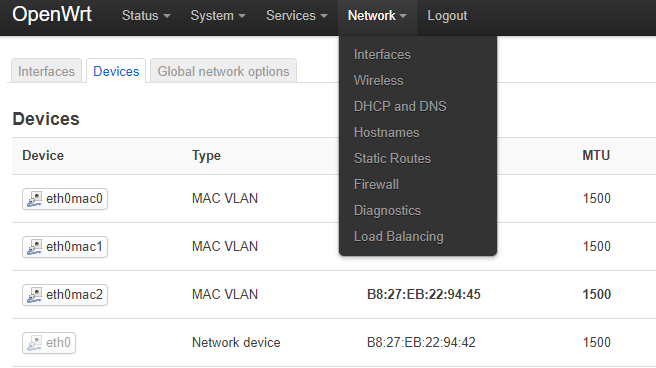

要几拨就添加几个设备，注意最好手工指定一下mac，基础设备选正常上网的wan口物理设备

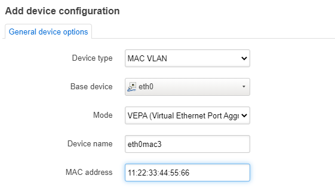

然后添加相同数量的接口，协议选DHCP，接口设备选刚刚创建的，一一对应

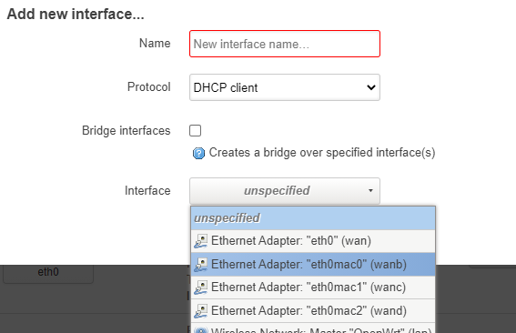

接口添加好后，进行连接就会自动获取IP了，然后与上面手工方式一样，把所有IP都认证一下

### 配置mwan3分流

在mwan的管理界面，首先添加接口，与网络里面刚刚配置的接口一一对应

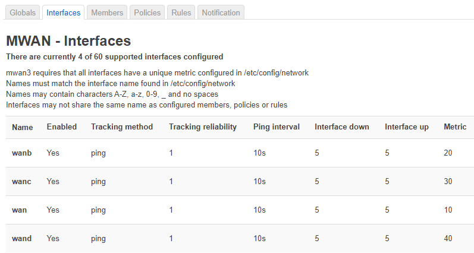


这里涉及到接口可用性的检测，需要仔细设置一下，后面的分流需要依赖这个可用性检测，总不能把流量分给不可用的接口吧


然后添加成员，与刚刚添加的接口一一对应，这里添加的可以在后面策略那里选择

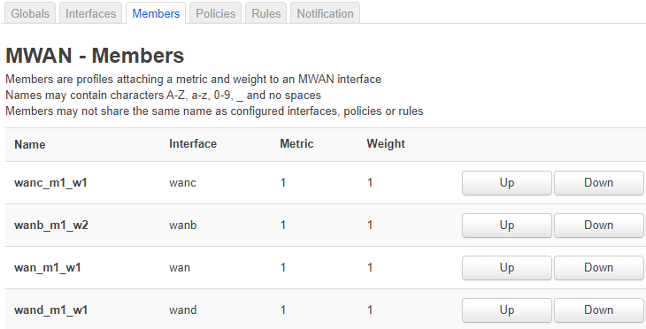

添加策略，图中第一条是负载均衡策略，刚刚添加的成员全都选中，意思就是说同时使用这所有的网络

后面几条策略分别是用来测试想用网络设备的

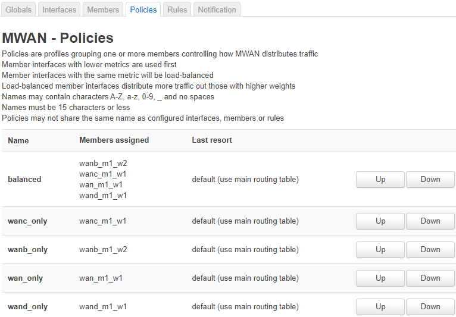

最后添加分流规则，最简单的如图所示，目的地址不限，端口不限，协议不限，都走负载均衡策略，也就是从所有网口出

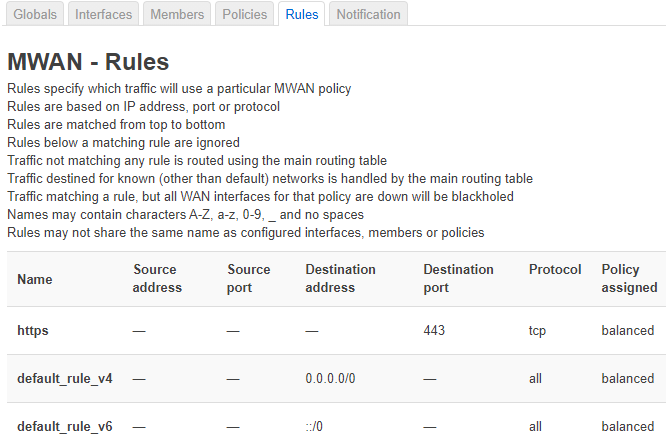

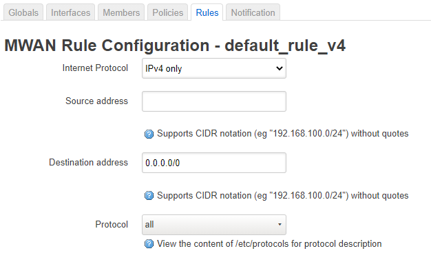

在状态面板可以看到，多拨成功

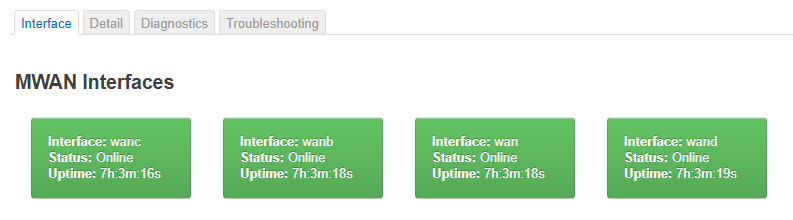


mwan3代码在：[https://github.com/openwrt/packages/tree/master/net/mwan3](https://github.com/openwrt/packages/tree/master/net/mwan3)    


## 爱快，分流很强大

正好我在的实验室里有老旧的台式机，又有多个网卡，我就安装了以分流著称的iKuai系统

爱快路由系统对性能要求很高，64位甚至要求4G运存才能安装，不太建议宿舍用，不过实话实话这个是真的爽

首先在网路设置中，选择正确的物理网卡，接入方式选`基于物理网卡的混合模式`，在DHCP模式下添加多个虚拟网络接口，mac地址自己指定

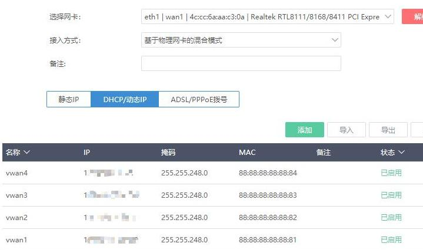

关开网络接口，让其DHCP获取到IP地址，然后按照之前说的方法进行网络认证

然后进入分流设置，配置多线负载

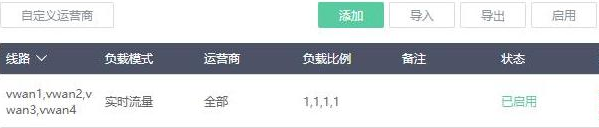

添加的时候有多种负载模式可供选择，可以添加多个负载规则。注意要把前面创建的网络接口全部开启

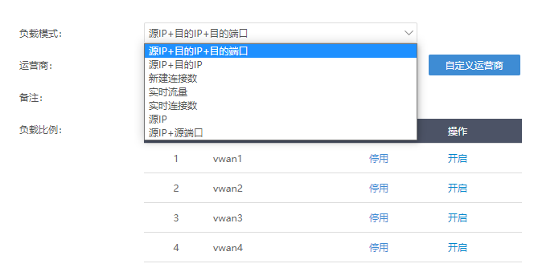

对！就是这么简单，iKuai就是牛，已经把网速叠加成功了

## 新发现

在与同学的交流中，发现校园网还可以用任意手机号验证码登录，登陆后的权限是访客，不过与学生权限一样，如此看来可以利用多个手机号突破5台设备的限制了

注意，登录成功后一定要修改密码，否则第二次登录的时候会提示创建新账号失败，是后台的BUG，日

最后，向大家推荐一个讲iptables的视频，可以在Youtube或者Bilibili搜索`坏人的iptables小讲堂`，讲的真的很不错
