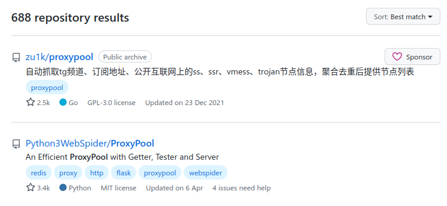

## 前言

昨天我舍友为了爬虫购买了昂贵的 IP 代理池，我在旁边突然萌生了一个想法，现在各大 ISP/IDC 动不动就给你分配一整个 64 位前缀的 IPv6 网段，我们能不能好好利用一下这庞大的 IPv6 IP 资源呢？

有了这个想法我就睡不着了，今天一大早（9点半）我就起来着手研究，最终成功实现每一个请求从一个单独的 IPv6 地址发出。

先看效果，我把写好的程序放在服务器上跑了一会，下面是 Cloudflare 统计的访问信息，可以看到独立访问者 (独立 IP) 数量达到了我的小博客前所未有的数量，基本上是一个请求一个独立 IP，效果非常不错。


## 教程

首先你要有一整个 IPv6 子网路由给你，当遇到吝啬的服务商，即使他们有巨多的 IPv6 资源，他也不给你用，这种情况你没辙。不过幸好，绝大多数 ISP/IDC 都会给你一整个 IPv6 `/64` 子网，有的甚至可以申请 `/56` 子网，这数量又增加了好几个数量级，所以你几乎不必担心。

为了方便实验，我购买了 [[Vultr 的服务器]](https://www.vultr.com/?ref=9039594-8H)，如果你还没有注册，可以使用我的 [[AFF 链接]](https://www.vultr.com/?ref=9039594-8H).

你可以通过 `ip a` 命令查看网络接口的地址，从而获取你的 IPv6 子网信息：

```sh
$ ip a
......
2: enp1s0: <BROADCAST,MULTICAST,ALLMULTI,UP,LOWER_UP> mtu 1500 qdisc fq state UP group default qlen 1000
    ......
    inet6 2001:19f0:6001:48e4:5400:3ff:fefa:a71d/64 scope global dynamic mngtmpaddr 
       valid_lft 2591171sec preferred_lft 603971sec
    inet6 fe80::b155:e257:a8f7:6940/64 scope link stable-privacy 
       valid_lft forever preferred_lft forever
```

可以看到，默认给你的 IPv6 地址是动态的，这是由 SLAAC 协议根据前缀和 Mac 地址自动生成的; 还有一个 `fe80` 开头的 IPv6 地址，这也是自动分配的本地链路地址。这很好，通过这些无状态地址配置协议，使 IPv6 避免的手动配置，即插即用。

在我的试验中，我拿到的子网为 `2001:19f0:6001:48e4::/64`，下面都以此为基础。

**绑定和路由**

在拿到 IPv6 子网后，需要添加路由。

```sh
# ip addr add local 2001:19f0:6001:48e4::/64 dev lo 
# 纠正：无需添加地址，这一行只能添加一个地址。我们通过 ip_nonlocal_bind 来允许绑定

ip route add local 2001:19f0:6001:48e4::/64 dev enp1s0
```

为了能够绑定任意 IP，我们需要开启内核的 `ip_nonlocal_bind` 特性：

```sh
sysctl net.ipv6.ip_nonlocal_bind=1
```

**NDP**

类似于 IPv4 中 ARP 协议的作用，IPv6 中需要使用 `ND` 协议来发现邻居并确定可用路径。我们需要开启一个 `ND` 代理：

安装 `ndppd`: `apt install ndppd`

编辑 `/etc/ndppd.conf` 文件:

```conf
route-ttl 30000
proxy enp1s0 {
    router no
    timeout 500
    ttl 30000
    rule 2001:19f0:6001:48e4::/64 {
        static
    }
}
```

启动 `ndppd`: `systemctl start ndppd`


只有使用 ND 协议进行主机发现的时候才需要开启 NDP。

如果整个子网是直接路由过来，则无需进行这一步。例如使用 Linode 或 He.com Tunnelbroker


**验证**

接下来你可以验证一下了，用 `curl --interface` 指定出口 IP：

```sh
$ curl --interface 2001:19f0:6001:48e4::1 ipv6.ip.sb
2001:19f0:6001:48e4::1
$ curl --interface 2001:19f0:6001:48e4::2 ipv6.ip.sb
2001:19f0:6001:48e4::2
```

可以看到，能够按照我们指定的任意 IP 进行请求

## Http 代理

为了方便使用，使用 Rust 写了一个 http 代理服务端，每一个请求会走指定 IPv6 子网下随机 IP，算是一个基础 demo

```sh
./http-proxy-ipv6-pool -b 127.0.0.1:51080 -i 2001:19f0:6001:48e4::/64
```

```sh
$ while true; do curl -x http://127.0.0.1:51080 ipv6.ip.sb; done
2001:19f0:6001:48e4:971e:f12c:e2e7:d92a
2001:19f0:6001:48e4:6d1c:90fe:ee79:1123
2001:19f0:6001:48e4:f7b9:b506:99d7:1be9
2001:19f0:6001:48e4:a06a:393b:e82f:bffc
2001:19f0:6001:48e4:245f:8272:2dfb:72ce
2001:19f0:6001:48e4:df9e:422c:f804:94f7
2001:19f0:6001:48e4:dd48:6ba2:ff76:f1af
2001:19f0:6001:48e4:1306:4a84:570c:f829
2001:19f0:6001:48e4:6f3:4eb:c958:ddfa
2001:19f0:6001:48e4:aa26:3bf9:6598:9e82
2001:19f0:6001:48e4:be6b:6a62:f8f7:a14d
2001:19f0:6001:48e4:b598:409d:b946:17c
```

欢迎 Star: https://github.com/zu1k/http-proxy-ipv6-pool

## 碎碎念

<!-- ### Proxypool 项目

舍友要买代理池，我就去 GitHub 上搜了一下，没想到我之前早已停更的项目竟然排在第一位。



排名第二的是专门给爬虫准备的代理池，作者是我的师兄，他对爬虫有非常深入的研究，推荐给大家。 -->

### 一开始的想法

其实我一开始的想法并不是直接给接口附加整个 IP 段的。一开始我并不知道网络接口可以直接附加一整个 IP 段，考虑到这个 IPv6 段数量过于庞大，通过枚举给接口附加多个静态 IP 显然不现实，所以我就在想办法去自己封装 IP 包然后进行注入。

我想到了两个注入数据包的方案：

1. 可以完全自己封装 IPv6 包以及下层协议，通过网卡的 raw fd 直接写数据

这个方案在我想到的一瞬间我就放弃了，因为协议过于复杂，我根本不可能实现

2. 创建一个 TUN 设备，配置这个 TUN 设备的网段为 IPv6 子网，然后将 TUN 设备和真实网络设备创建网桥。

通过 TUN 向系统网络栈注入源 IP 为网段下随机的 IPv6 地址，伪造有众多 host 的假象。

因为前面稍微了解过 TUN (可以看我之前写的文章[[使用 TUN 的模式]](../../coding/tun-mode/))，所以自然而然我就会有这个想法，并且我深信这是可行的。我之所以认为这样可行，是因为之前搞过 [[给每一个 Docker 容器一个独立的 IP]](../../coding/set-ipv6-for-every-docker-container/)，同样是充分利用丰富的 IPv6 资源，感兴趣的同学可以看一下。

通过搜索资料，最后确定使用 TUN 不可行，至少要用 TAP，[[因为要处理 NDP 协议]](https://serverfault.com/questions/949945/ipv6-on-Linux-tun-tap-ndp-not-working)，具体后面的细节我也没有深入研究。

幸亏后面搜资料发现了本文方便的方法，才避免了我陷入这些迷途。反思一下，即自己的知识不够，对 Linux 内核及其提供的众多功能了解不够深入，导致人家原本就有的功能自己根本不知道，所以想不出合适的方案。

### WAF

我也不是非常了解，现在的 WAF 是不是就是单纯根据 IP 来进行限流限速 ？如果真是这样，那利用这庞大的 IPv6 资源岂不是轻松绕过封禁。

如果是会直接封禁或者限制整个子网，会不会有很严重的误杀，毕竟不是所有 ISP 都会这么大方的给一整个 IP 段。

有了解的小伙伴欢迎评论交流。
