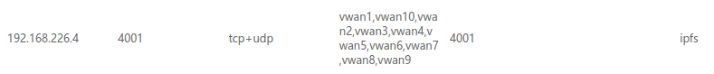
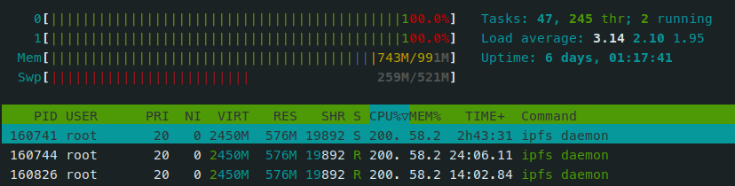
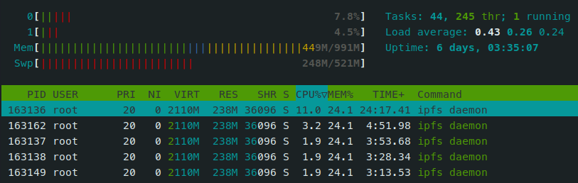

这两天，V2EX 的站长 Livid [发布了](https://v2ex.com/t/857404) 一款基于 IPFS 和 ENS 的内容发布和订阅应用 [[Planet]](https://planetable.xyz/)，其想法在之前的一期 [[播客访谈]](https://fyfy.fm/episode/67) 中就提到过，当初就觉得很有意思。也不出我所料，Planet 一经发布就引来了众多关注，Planet 用图形化的方式使更多普通人可以尝试 IPFS 这类分布式内容发布，据说后面还会增加评论功能，这在 IPFS 网络中也算是一个不小的挑战，不知道 Planet 能将易用性做到什么水平，我会继续关注。

我也在很早之前就了解并开始使用 IPFS 技术，在折腾的过程中也积累了一些经验，下面我将向你们分享一些使用技巧，使你的 IPFS 更加易用。

> 完全新手朋友请先阅读我在 20年写的 [《IPFS 新手指北》](../ipfs/) 这篇文章

## 搭建网关

相比较使用公共 IPFS 网关，我更推荐自己在家中搭建，不仅能提供更优的体验，还可以避免在每台电脑安装 IPFS 的麻烦。

按照普通教程在服务器上安装好 IPFS 后，你需要修改配置文件，对外开放 Api 和 Gateway。

> 因为是在家庭网络中，我就不额外介绍访问控制配置，如果你是在公网服务器搭建，需要注意配置访问控制以免被滥用

修改 API 和 Gateway 绑定的 IP 为 `0.0.0.0` 以开放给局域网，然后修改 API 的 http header 配置跨域：

```json
"API": {
  "HTTPHeaders": {
    "Access-Control-Allow-Headers": [
      "X-Requested-With",
      "Range",
      "User-Agent"
    ],
    "Access-Control-Allow-Methods": [
      "GET",
      "POST",
      "OPTIONS"
    ],
    "Access-Control-Allow-Origin": [
      "*"
    ]
  }
}
```

配置子域名网关，可以达到 `dweb.link` 的效果。例如要使用 `*.ipfs.zu1k.com` 作为子域名网关，就要先将泛域名解析到 IPFS 网关的 IP，然后在 Gateway 配置中增加以下内容：


```json
"Gateway": {
  "PublicGateways": {
    "ipfs.zu1k.com": {
      "NoDNSLink": false,
      "Paths": [
        "/ipfs",
        "/ipns",
        "/api"
      ],
      "UseSubdomains": true
    }
  },
}

```

为获得更好的 IPFS 使用体验，推荐安装 [[IPFS 浏览器插件]](https://chrome.google.com/webstore/detail/ipfs-companion/nibjojkomfdiaoajekhjakgkdhaomnch)，或者使用 Brave 浏览器，可以让 IPFS 的使用体验更加原生。

## Pin 优化

在发布内容后，马上通过公开的 IPFS 网关访问，通常会很慢很慢，甚至到超时都无法访问，这是由 IPFS 的寻址过程导致的。随着访问内容的用户越来越多，他们的 IPFS 节点上会缓存你内容的数据，这个时候新节点再访问同一份内容，通常就会很快。这就是 IPFS 的特性，就跟 BT 下载的原理类似，数据在网络中存在的副本越多，就越能利用 P2P 网络的性能。

但是一个 IPFS 节点也不会无限期的缓存你的数据，默认配置下 GC 频率是 1 个小时一次，也就是说你的数据如果用户不访问，在一个小时后就会从他们的节点中被清理掉。为了能够让我们的数据长久的留在 IPFS 网络中，就需要用户 Pin 住你的数据，以防被 GC 掉。我的做法是利用闲置的服务器搭建 IPFS 节点用来 Pin 自己的数据，然后朋友之间互相 Pin 住，算是合作共赢。

所以大家不妨 Pin 一下我的博客：`ipfs pin add /ipns/zu1k.com`

如果你使用 IPNS 或者域名的方式对外公开经常修改的内容，就需要设置定时任务来不断 Pin 住新的数据，因为 IPFS 在 Pin 一个 IPNS 的时候，只会 Pin 当前状态对应的 CID ，后面不会自己去更新。

### Remote Pinning Service

如果你不想一直运行本机的 IPFS 节点，但又想让别人可以访问到你发布的内容，可以考虑使用 Remote Pinning service，这是由一些中心化的服务商提供的内容 Pinning 服务，其效果与你本机 pin 相当。甚至因为他们的网络质量更好、连接的节点更多，将内容 Pin 在他们的节点上，可以更快的被分发和访问。

我主要推荐两家，[[Pinata]](https://www.pinata.cloud/) 和 [[web3.storage]](https://web3.storage/account/)，具体教程可以看 [官方文档](https://docs.ipfs.io/how-to/work-with-pinning-services/#use-an-existing-pinning-service)

```bash
# ipfs pin remote service ls
Pinata       https://api.pinata.cloud/psa
web3_storage https://api.web3.storage
```
Pinata 是无门槛的，免费提供 1G 的 Pin 容量。

web3.storage 免费提供 1T，但是 Pin Api 需要发邮件申请，一天以内就会有回复。[[教程]](https://web3.storage/docs/how-tos/pinning-services-api/)

### 开放端口

因为 IPFS 需要 P2P 通讯，所以如果你没有公网的 IPFS 节点 Pin 你的内容，就需要保证自己本机的 IPFS 节点可被访问。检查你的路由器，开启 UPnP 功能，必要时建立端口映射，开放你的 4001 端口（如果没有修改过的话）。



## 资源占用优化

如果你没有做任何的配置优化，只是按照常规流程下载安装运行，你会发现 IPFS 在后台会占用大量的 CPU 资源和内存，你的风扇开始狂转；维持了大量的网络连接，导致你的网络卡顿。这是因为 IPFS 的默认配置并没有针对个人小主机进行优化，如果你在一台 2 核的 Linux 服务器上运行，IPFS 甚至能吃满你所有的 CPU，网络的拥挤程度有可能使你连 ssh 登录都成了一个问题。



这个时候我们就需要调整配置文件中的参数来想办法降低资源占用，以使 IPFS 不影响我们的日常工作。其实 IPFS 已经提供了[好几个配置文件](https://docs.ipfs.io/how-to/default-profile/)，通过 `ipfs config profile --help` 可查看具体介绍。

> profile 不知道怎么翻译合适，翻译成文件不太准确，ipfs 中应用这些 profile 只是修改某些特定选项，并不是配置文件的完全改变

我推荐在低配置的服务器和个人电脑上应用 `lowpower` 配置，`ipfs config profile apply lowpower`，这会限制 IPFS 维持的连接数量，降低网络占用，还会降低 GC 频率，这可以明显的降低 cpu 占用，我的测试可以使 cpu 占用从 80% 以上降低到 20% 以下。当然，资源占用的降低也会导致通讯效率的降低，会使内容寻址时间增长，影响使用的体验。如果你的使用方式是类似于 RSS 订阅和离线查看的模式，增长的寻址时间可以忽略不记。

如果你是在拥有公网 IP 的服务器上运行 IPFS，还推荐应用 `server` 配置，`ipfs config profile apply server`，这会关闭本地网络的节点发现，因为这是无意义的，这样也可以降低网络占用。



## 后言

20 年 11 月底，我发布了 [《IPFS 新手指北》](../ipfs/) 这篇文章，期待 IPFS 能够迅猛发展，成为下一代 Web 基础设施。不知不觉已经过去一年半了，就目前情况来看 IPFS 虽然仍在不断发展，但还是在半死不活的状态，这一点让我非常失望。

但仔细一想，期待某门技术成为下一个主流本身就是不合理的。任何技术都应该是在广泛的需求之下才有可能成长为广泛应用的主流，而不是说你有某些好的特性就一定能够被广泛接受。从需求上讲，我们确实需要基于 P2P 的内容发布，也需要基于内容的寻址方式，这些都具有非常好的优点，但并不能满足我们对互联网的全部需求。我们在期望内容不可变、内容不被删除的同时，也会希望能够拥有删除或者修改某个内容的权利；我们喜欢 P2P 的去中心化内容分发方式，但不能否认任何人都希望延迟更低、速度更快；我们还会希望对内容具有更多控制权，包括细致的访问控制、更灵活的表达形式......

基于以上想法，我不认为 IPFS 就是下一代 Web，也就是都在说的 Web3。但我不否认 IPFS 有巨大的潜力，在下一代 Web 中充当非常重要的角色，只是这个角色并不是全部。而基于 P2P 的内容分发方式早就不是什么新技术，BitTorrent 和 基于 BT 技术的 BtSync、BTFS 也都非常具有竞争力，IPFS 想要与其竞争需要更加努力，使其更加的易用和平民化。

我自己也已经使用 IPFS 接近两年，这两年的时间我自己的感觉是 IPFS 本身没有太大的突破性发展，而围绕其进行的各种营销和唬人活动层出不穷，文件挖矿、NFT 等等，不过这些也的确让更多人关注起 IPFS，并为 IPFS 网络贡献了大量节点和存储空间，但我总觉得怪怪的，这不是发展的长远之道啊。

不过看近几年互联网越发封闭，内容审查越发严格，想必 IPFS 这类分布式内容发布方式会被更多非技术人关注，期待在这个需求激增的关头，有更多优秀的应用浮现，将 IPFS 推展开来，让更多普通人能够更加方便的使用这些新技术，享受新技术带来的权利，那些我们本该拥有但被剥夺的权利。
