## IPFS简介

**IPFS**全称`InterPlanetary File System`，中文名叫**星际文件系统**，听起来非常酷炫。

它是是一个旨在创建**持久**且**分布式**存储和**共享**文件的网络传输协议，是一种内容可寻址的对等超媒体分发协议。在IPFS网络中的**全球所有**节点将构成**一个**分布式文件系统，全球中的每一个人都可以通过IPFS网关存储和访问IPFS里面的文件。

这个酷炫的项目最初由Juan Benet设计，自2014年开始由Protocol Labs在开源社区的帮助下发展，是一个**完全开源**的项目。

- [IPFS官网](https://ipfs.io/)
- [GitHub](https://github.com/ipfs)

## IPFS的优点

### 与现有Web比较


#### 现有的网络技术效率低下、成本高昂

HTTP一次从一台计算机下载文件，而不是同时从多台计算机获取文件。点对点IPFS**节省了大量的带宽**，视频高达60%，这使得无需重复地高效地分发大量数据成为可能。


#### 现有的网络无法保存人类的历史

一个网页的平均寿命是100天，然后就永远消失了。我们这个时代的主要媒介还不够脆弱。IPFS**保留文件的每一个版本**，并使为镜像数据建立弹性网络变得简单。


#### 现有的网络是集中的，限制了机会

互联网作为人类历史上最伟大的均衡器之一，推动了创新的发展，但日益巩固的集权控制威胁着这一进步。IPFS通过分布式技术来避免这一点。


#### 现有的网络深度依赖主干网

IPFS支持创建多样化的弹性网络，以实现**持久可用性**，无论是否有Internet主干网连接。这意味着发展中国家在自然灾害期间，或者在咖啡厅的wi-fi上时，能够更好地连接。

### IPFS做的更好

IPFS宣称，无论你现在在用已有的Web技术干什么，IPFS都可以做到更好。


- 对于**归档人员**

    IPFS提供了数据块去重、高性能和基于集群的数据持久化，这有利于存储世界上的信息来造福后代

- 对于**服务提供商**

    IPFS提供安全的P2P内容交付，可以为服务提供者节省数百万带宽成本

- 对于**研究者**

    如果您使用或分发大型数据集，IPFS可以帮助您提供快速的性能和分散的归档


- 对于**世界发展**

    对于那些互联网基础设施较差的人来说，高延迟网络是一大障碍。IPFS提供对数据的弹性访问，独立于延迟或主干网连接

- 对于**区块链**

    使用IPFS，您可以处理大量数据，并在事务中放置不可变的永久链接—时间戳和保护内容，而不必将数据本身放在链上

- 对于**内容创造者**

    IPFS充分体现了网络的自由和独立精神，可以帮助您以更低的成本交付内容

## 工作原理

让我们通过向IPFS添加一个文件这个过程，来简单看一下IPFS是如何工作的


IPFS将文件切割为多个小块，每个块的大小为256KB，块的数量由文件的大小决定。然后计算每个块的Hash，作为这个块的指纹。


因为很多文件数据有重复的部分，在切割成小块后，这些小块有的会完全相同，表现出来就是指纹Hash相同。拥有相同指纹Hash的块被视为同一个块，所以相同的数据在IPFS都表现为同一块，这也就消除了存储相同数据的额外开销。


IPFS网络中的每一个节点只存储自己**感兴趣**的内容，也就是该IPFS节点的使用者经常访问、或指定要固定的内容。

除此之外还需要额外存储一些索引信息，这些索引信息用来帮助文件查找的寻址工作。当我们需要获取某个块的时候，索引信息就可以告诉IPFS这个特定块在哪些节点上有存储。


当我们要从IPFS中查看或者下载某个文件时，IPFS便要通过改文件的**指纹Hash**查询索引信息，并向自己连接的节点进行询问。这一步需要找到IPFS网络中的哪些节点存储着自己想要的文件数据块。

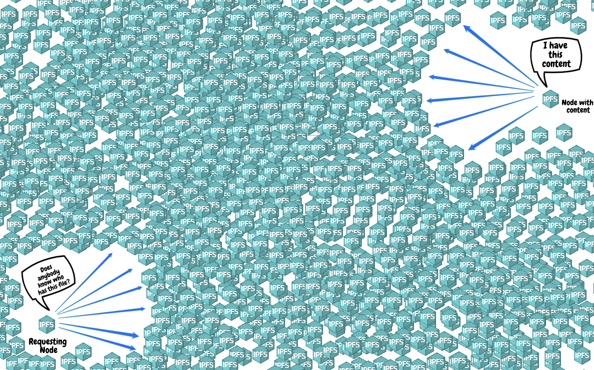

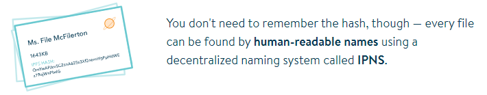

如果你无法记住IPFS中存储的文件的指纹Hash(是一段非常长的字符串)，实际上你也无须记住这个Hash，IPFS提供了**IPNS**来提供**人类可读名字**到**指纹Hash**之间的映射，你只需要记住你添加在IPNS中的人类可读名字即可。

## 基本使用

### 安装

设置环境变量`IPFS_PATH`，这个目录在后面进行初始化和使用的时候会作为IPFS的本地仓库。如果这里不进行设置，IPFS默认会使用用户目录下的`.ipfs`文件夹作为本地仓库。


#### 初始化

运行命令 `ipfs init` 进行初始化，这一步会初始化密钥对，并在刚刚指定的`IPFS_PATH`目录创建初始文件。

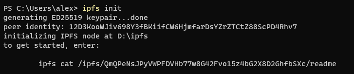

#### 查看节点ID信息

运行命令 `ipfs id` 即可查看自己IPFS节点ID信息，包含了节点ID、公钥、地址、代理版本、协议版本、支持的协议等信息

可以通过 `ipfs id 别人的ID`来查看别人的节点ID信息

#### 检查可用性

通过显示的命令来检查可用性，这里使用`ipfs cat`命令来查看指定的`CID`对应的内容。


#### 开启守护进程

运行下面命令开启守护进程

```powershell
ipfs daemon
```

### 获取文件(夹)

IPFS获取文件的方式是隐式的，我们可以通过查看、下载等命令，告诉IPFS你要去获取我想要的文件

#### 查看文本

查看文本使用 `ipfs cat`命令来进行，就如前面检查可用性的使用一样

#### 下载二进制

对于图片、视频等文件，无法使用`cat`命令来查看（cat出来是一堆乱码），此时我们可以使用`ipfs get cid`的方式来将文件下载到本地。不过这样直接下载文件名会是指定的CID，一个长字符串不具有识别性，我们可以重定向到指定的文件，`ipfs get cid -o newname.png`

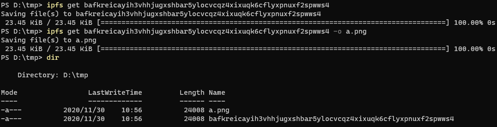

#### 列出目录

通过`ipfs ls`命令来列出一个目录

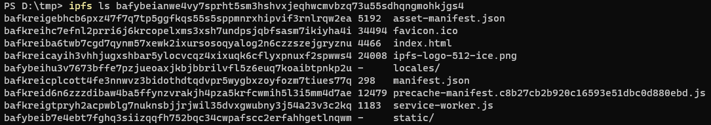

### 添加文件(夹)

通过`ipfs add 文件名`命令来将文件添加到IPFS

如果需要添加文件夹，需要添加`-r`参数来使其递归处理

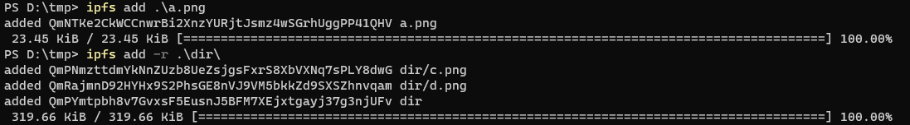

## 相关概念

在进行深一步学习之前，先让我们来看一下关于IPFS几个不得不知道的概念，这些概念是IPFS的基础组成部分，对后续的使用至关重要

### Peer

**Peer**是对等节点，因为IPFS是基于P2P技术实现的，所以没有服务器客户端这一说，每个人都同时是服务器和客户端，人人为我，我为人人。

### CID

**内容标识符**（CID）是一个用于指向IPFS中的内容的标签。它不指示内容存储在哪里，但它根据内容数据本身形成一种地址。无论它指向的内容有多大，CID都很短

详细内容见：[IPFS官方文档：Content addressing and CIDs](https://docs.ipfs.io/concepts/content-addressing/)

在线的CID查看器：[CID Inspector](https://cid.ipfs.io/)

### Gateway

- IPFS官方提供的Gateway: https://ipfs.io/
- Cloudflare提供的IPFS Gateway服务：https://cf-ipfs.com
- 其他公开的Gateway列表：https://ipfs.github.io/public-gateway-checker/

https://www.cloudflare.com/distributed-web-gateway/

具体见：[IPFS文档：Gateway](https://docs.ipfs.io/concepts/ipfs-gateway/)

### IPNS

IPFS使用基于内容的寻址方式，简单说就是IPFS根据文件数据的Hash来生成CID，这个CID只与文件内容有关，这也就导致了如果我们修改这个文件的内容，这个CID也会改变。如果我们通过IPFS给别人分享文件，则每次更新内容时都需要给此人一个新链接。

为了解决这个问题，星际名称系统（IPNS）通过创建一个可以更新的地址来解决这个问题。

具体见：[IPFS文档：IPNS](https://docs.ipfs.io/concepts/ipns/)

### IPLD

https://docs.ipfs.io/concepts/ipld/

## 在IPFS部署网站

既然IPFS宣称能够构建新一代分布式Web，那我们便想要把自己的网站部署到IPFS上去，一起体验一下去中心化、分布式的Web3.0技术

### 将文件添加到IPFS中

我使用的是Hugo静态网站生成器生成我的博客，生成的内容存放在`public`目录下，所以首先我需要将`public`目录及其里面的所有内容添加到IPFS中。

```powershell
# -r 参数代表递归添加
ipfs add -r public

# 实际运行效果
PS D:\blog> ipfs add -r public
added QmZT5jXEi2HFVv8tzuDqULBaiEPc8geZFVjXxb9iAsBqbg public/404.html
added QmcGDfkg6mcboba3MkNeamGQvRgdnHiD4HZhvCRwEnSdSj public/CNAME
很长的滚屏后......
added QmT61SS4ykbnt1ECQFDfX27QJdyhsVfRrLJztDvbcR7Kc1 public/tags
added QmdoJ8BiuN8H7K68hJhk8ZrkFXjU8T9Wypi9xAyAzt2zoj public
 35.12 MiB / 35.12 MiB [===========================================] 100.00%
```

如果你不想看这么长的滚屏，只想要最后一个Hash，可以添加一个 `Q` （quiet） 参数

```powershell
PS D:\blog\blog> ipfs add -rQ public
QmdoJ8BiuN8H7K68hJhk8ZrkFXjU8T9Wypi9xAyAzt2zoj
```

### 通过IPFS网关访问

在刚刚添加完成的最后，名称为`public`的那串Hash便是public目录的CID，我们现在可以通过这个CID在IPFS网关上访问我们刚刚的添加的内容。

#### 本机网关访问

我们先通过本机的IPFS网关来访问一下，看看有没有添加成功。注意这一步需要你本地已经开启了IPFS守护进程。

访问：[http://localhost:8080/ipfs/QmdoJ8BiuN8H7K68hJhk8ZrkFXjU8T9Wypi9xAyAzt2zoj](http://localhost:8080/ipfs/QmdoJ8BiuN8H7K68hJhk8ZrkFXjU8T9Wypi9xAyAzt2zoj)

然后浏览器会自动进行跳转，可以看到能够正常访问我们的页面

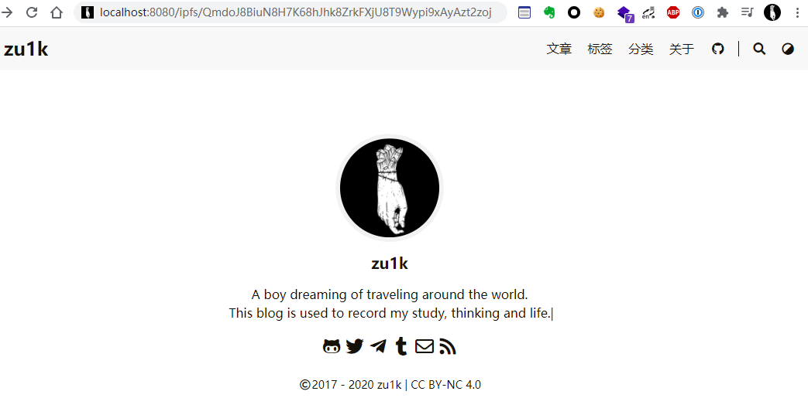


你会发现浏览器地址栏的网址为一个另一个**长字符串**构成的域名

长字符串.ipfs.localhost:8080

这里的长字符串是IPFS中的另一个概念：IPLD


如果你的页面只能够显示内容，但是样式是错误的，如下图

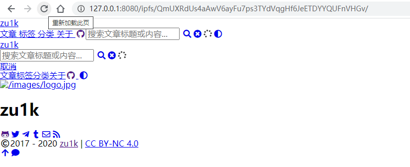

这是因为使用的是**绝对地址**，我们需要使用**相对地址**的形式，如果你和我一样使用Hugo，那么只需要在你的配置文件中增加 `relativeURLs = true` 即可

#### 远程网关访问

刚刚我们通过本机的IPFS网关成功访问到了IPFS中的网站，现在我们找一个公开的其他的IPFS网关来访问试一下

这里我选择IPFS官方维护的网关：https://ipfs.io，访问：https://ipfs.io/ipfs/QmdoJ8BiuN8H7K68hJhk8ZrkFXjU8T9Wypi9xAyAzt2zoj

需要注意的是，此时网站还只存在于我们本机上，其他IPFS网关从IPFS网络中找到我们的网站文件需要一段时间，我们需要保证此时IPFS守护进程不关闭并已经连接了成百上千的其他节点，这样有利于IPFS官方Gateway尽快找到我们。

经过多次刷新和焦急的等待后，终于有了显示


### 使用IPNS进行映射

使用命令 `ipfs name publish CID` 来发布一个IPNS，这里可能需要等待一会

```powershell
PS D:\blog\blog> ipfs name publish QmdoJ8BiuN8H7K68hJhk8ZrkFXjU8T9Wypi9xAyAzt2zoj
Published to k51qzi5uqu5djhbknypxifn09wxhtf3y1bce8oriud1ojqz5r71mpu75rru520: /ipfs/QmdoJ8BiuN8H7K68hJhk8ZrkFXjU8T9Wypi9xAyAzt2zoj
```


通过使用IPNS映射，后续我们可以不断更新网站内容。如果没有使用IPNS而是直接发布CID，那别人便无法访问最新的版本了


如果使用了IPNS，需要备份节点的`私钥`和生成IPNS地址时生成的`Key`

它们分别存储在你init时显示的目录下的`config`文件和`keystore`文件夹内


### 解析域名

IPNS不是在IPFS上创建可变地址的唯一方法，我们还可以使用**DNSLink**，它目前比IPNS**快得多**，还使用**人类可读**的名称。

例如我想要给刚刚发布在IPFS上的网站绑定`ipfs.zu1k.com`这个域名，那我就需要创建`_dnslink.ipfs.zu1k.com`的**TXT**记录

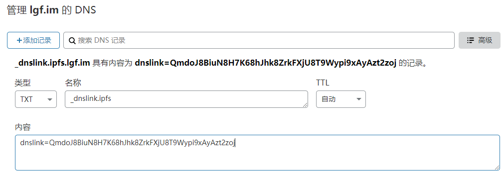

然后任何人都可以用 `/ipfs/ipfs.zu1k.com` 来找到我的网站了，访问[http://localhost:8080/ipns/ipfs.zu1k.com](http://localhost:8080/ipns/ipfs.zu1k.com)

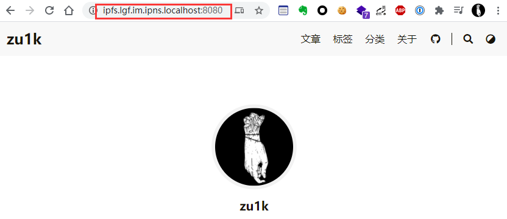

详细文档见：[IPFS文档：DNSLink](https://docs.ipfs.io/concepts/dnslink/#publish-using-a-subdomain)

### 更新内容

更新内容时，只需要再添加一次，然后重新发布IPNS，如果你是使用DNSLink的方式，还需要修改DNS记录

## 底层技术

### Merkle有向无环图（DAG）

每个Merkle都是一个有向无环图 ，因为每个节点都通过其名称访问。每个Merkle分支都是其本地内容的哈希，它们的子节点使用它们的哈希而非完整内容来命名。因此，在创建后将不能编辑节点。这可以防止循环（假设没有哈希碰撞），因为无法将第一个创建的节点链接到最后一个节点从而创建最后一个引用。

对任何Merkle来说，要创建一个新的分支或验证现有分支，通常需要在本地内容的某些组合体（例如列表的子哈希和其他字节）上使用一种哈希算法。IPFS中有多种散列算法可用。

输入到散列算法中的数据的描述见 https://github.com/ipfs/go-ipfs/tree/master/merkledag

具体见：[IPFS文档：Merkle](https://docs.ipfs.io/concepts/merkle-dag/)

### 分布式散列表DHT

具体见：[IPFS文档：DHT](https://docs.ipfs.io/concepts/dht/)

## 上层应用

IPFS作为一个文件系统，本质就是用来存储文件，基于这个文件系统的一些特性，有很多上层应用涌现出来。

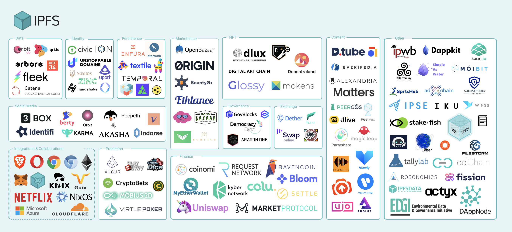

## Filecoin

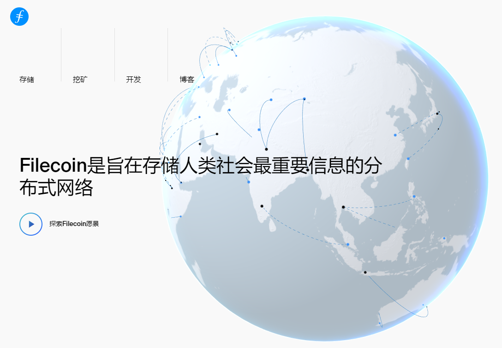

## 基于IPFS构建应用

IPFS提供了IPFS协议的**Golang**和**JavaScript**实现，可以非常方便的将IPFS集成到我们的应用当中，充分利用IPFS的各种优势。

## 未来的期望

对于P2P：https://t.zu1k.com/post/618818179793371136/%E5%85%B3%E4%BA%8Eresilio-sync

## 一些问题

### IPFS可以永久存储文件？

很多人误认为IPFS可以永久存储文件，从使用的技术来讲的确更有利于永久存储内容，但是还需不断需要有人访问、Pin、传播该内容，否则待全网所有节点都将该内容数据GC掉，数据还是会丢失。

### IPFS是匿名的？

有人认为P2P就是匿名的，就像Tor一样，就像以太坊一样。实际上绝大部分P2P应用都不是匿名的，IPFS也不是匿名的，所以当你在发布敏感信息的时候，需要保护好自己。IPFS目前还不支持Tor网络。

### IPFS速度快，延迟低？

从理论上来讲，只要节点数量足够多，基于P2P技术的IPFS速度能够跑满你的带宽，延迟也有可能比中心化的Web低。但实际上，就目前情况而言，使用IPFS的人并不多，你链接的IPFS节点最多也就1000个左右（至少目前阶段我最多也就撑死连1000个以内），所以并不能达到理论的理想状态，所以现在IPFS的速度并不是很快，并且很少人访问的冷数据延迟很高，还有大概率找不到。

### IPFS是骗局，Filecoin是骗局？

的确，目前有很多投机的人，他们想要通过销售所谓的IPFS矿机（其实就是普通的电脑接上大硬盘）来盈利，所以他们故意去混淆IPFS、Filecoin、比特币、区块链等概念，打着永久存储的伪概念，用区块链这个热点来欺骗啥都不懂的老人，这种行为非常无耻。

实际上，IPFS本身并不是骗局，基于IPFS产生的激励层Filecoin也不是骗局，从我的使用来看，任何人都**无需**特意去购买任何所谓的IPFS矿机，只需要在自己的电脑运行时，后台跑一个IPFS守护进程就可以了。不要被所谓的**币**冲昏了头脑。

## 参考资料

- [IPFS官网](https://ipfs.io/)
- [IPFS文档](https://docs.ipfs.io/)
- [IPFS博客](https://blog.ipfs.io/)
- [维基百科：星际文件系统](https://zh.wikipedia.org/wiki/%E6%98%9F%E9%99%85%E6%96%87%E4%BB%B6%E7%B3%BB%E7%BB%9F)
- [将博客部署到星际文件系统（IPFS）](https://io-oi.me/tech/host-your-blog-on-ipfs/)

## 资源分享

- 机械工业出版社294G原版PDF：[/ipfs/QmZYDnPgTRs1MmBx9TPrADFV1K85sPSqLJhAShWayubu9c](https://ipfs.io/ipfs/QmZYDnPgTRs1MmBx9TPrADFV1K85sPSqLJhAShWayubu9c/)
