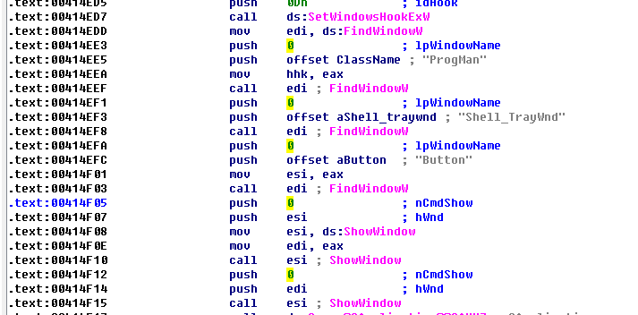
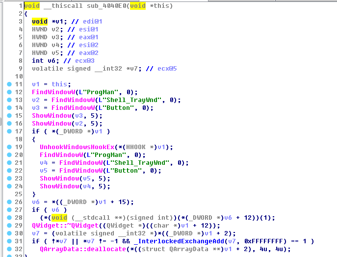
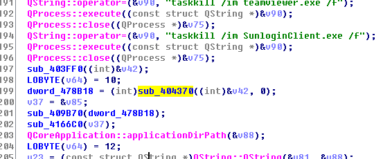
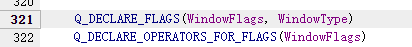
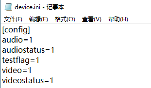

# 逆向破解学校在线考试客户端

## 前言

近期，学校开始测试线上考试系统，据说十分流氓，开搞！

从大一学弟那里拿到了相关程序和说明文档，经过学弟的使用体验，程序开始运行会自动杀死QQ、微信等程序，隐藏并屏蔽任务栏和开始菜单，强制全屏并屏蔽一些常用的快捷键包括窗口切换等。

## 开搞

### 基本信息

在虚拟机里安装程序后，先观察一下安装目录结构和里面的文件

仔细查看了各个文件夹下的内容，最终得出结论，是个QT编写的套壳浏览器，用的 QtWebEngine

查看主程序的信息，32位未加壳C++程序，本身非常小，只有不到1M，大部分功能应该都是调库实现的

下面开始逆向，拖入IDA 32位，自动定位到入口函数start，从执行流图中可以看到程序本身结构非常简单

### 正着走

下面从start开始分析

可以看到一开始start函数的栈指针分析就出问题了，但是start本身的调用非常简单，不妨来看一下
首先是 第一个call指令，进入这个函数

发现是 security_cookie检查，没有什么实际作用

第二个是个无条件跳转 jmp，进去看一下

可以看到这一段东西比较多，特别是各种不知道什么作用的call非常多，并且自动反编译出问题了，这个反编译问题应该是比较好解决的，我没有深究

简单看了一下调用的call，越深入越复杂，到这里分析不下去了，东西有点多，从其他方面入手

### 去除杀进程

先来看一下字符串，很幸运字符串没有进行加密，因为我们知道程序会杀死qq，不如直接来搜索关键字QQ

看一下交叉引用

只有一个函数调用了它，先进入看看这个函数，关键部分如下

这就比较清楚了，程序是通过QProcess调用taskkill命令来强制来杀死这些程序的，会被杀死的程序包括实时聊天软件qq、微信，远程协助软件teamviwer、向日葵远程控制。

在这里我们需要去除这个杀死进程的机制，直接将执行的命令字符串给清空就行

### 去除隐藏任务栏

同时这段命令所在的这个函数在前面还有一堆对QtWebEngine的初始化

这个函数后面的部分有点意思，看到了一些字符串不清楚什么意思

我个人对tray比较敏感，因为做过任务栏图标程序的开发，知道任务栏的英文是tray

这里对 Shell_TrayWhd 进行搜索

发现windows系统有一些特殊的窗口句柄，而这个正式任务栏窗口句柄

一开始我还对这个考试程序怎么隐藏任务栏感兴趣，现在都一目了然了，先通过系统函数获得句柄，然后调用ShowWindow将窗口设置为不显示

这里的ProgMan是任务管理器，所以说这段代码同时屏蔽了任务栏、开始菜单和任务管理器

我们需要去除这种屏蔽机制，这也非常简单，来看汇编

发现在调用showwindow前需要将参数 True or False push入栈，也就是 call ShowWindow前面的push 0，只需要修改这几处汇编即可

将push 0修改为push 1即可去除他的屏蔽(后面的分析知道 push 5 比较好)

### 去除强制全屏

下面我们来去除一下窗口全屏，虽然有任务栏可以用了，但是全屏会挡住，不好用

还是刚刚那个函数，通过不断查交叉应用，最后定位到start第二次jmp后的代码中

通过前面对前前后后的call和跳转的分析，可以知道没有啥具体内容，所以还得从刚刚的那个函数入手

发现后面有一个call

进入后

发现这个函数是要将之前设置的任务栏隐藏等给还原，所以这里应该是要退出了，重要的内容还是在杀死qq的那些操作和这个函数中间的位置

仔细分析后，找到了关键的地方

这和函数在最后面会获取主屏幕的长和宽，然后调用resize函数设置窗口大小，从而使窗口占满屏幕

这里看一下汇编

其实还是比较难搞的，东西比较紧凑，没法插入太多的汇编，又不想进行大改增加一个call，那就只把开始菜单的地方留出来吧，也就是只修改窗口的高

因为需要先把高入栈，所以前面的宽先存到 esi，我们先不要动这个，先把高减一个数然后push进去再push esi，修改之后如下

这样显示的窗口就不会挡住任务栏，我们就可以切换窗口了

### 恢复窗口和按钮

后来又想，如果可以手动修改窗口大小就好了，再有个放大、缩小的按钮并且能移动位置就更爽了，那就接着搞

之前做过qt的开发，知道有一个窗口属性是可以隐藏系统窗口，只显示里面的内容从而使窗口无法修改大小和移动位置

搜索一番后发现使用的使 setWindowFlags 函数来实现的，那就从imports里面找一下吧

看交叉引用然后一个一个进去看，最后定位到一个函数，我给他起名 initWindowsComponent，前面的分析我也都相应的进行改名了，分析起来方便记忆

我这个起名应该是非常贴切了，的确是往窗口里面添加各种菜单按钮组件

在后面找到了setWindowFlags调用，但是因为qt里面用的是枚举类型，编译后都变成数字了，只能去看qt的源码

传入的枚举类型使WindowsFlags类型，跟进去后发现又是一个WindowType类型

再接着跟进，就看到了全部的内容

2048换成16进制是0x800

根据代码是无边框类型

我们需要的是有边框有放大缩小和关闭按钮，所以需要的类型是

此时还没有关闭按钮，根据计算方式，还需要或上关闭按钮的值

修改这个参数后窗口就可以随意移动、修改大小、缩小或者全屏了。

### 绕过摄像头检查

我们还知道这个程序还必须要摄像头检查通过，通过简单的实验，发现摄像头只需要检查通过一次，后面不会重复检查，只会读取device.ini文件，所以我们增加这个文件，并手动指定检查通过

同时通过搜索字符串查看交叉引用可以找到需要读取或者写入文件的地方，这里没有深入研究了，谁敢兴趣谁去研究

### 其他地方

在对这个程序探究的过程中，还发现了tab栏和menu栏可以打开显示，但是实际作用不大，就没有管。

同时通过burp抓包和测试，找到了在线考试的登录接口并发现普通浏览器可以正常使用

同时通过对相关接口的测试，找到了任意密码修改和个人信息泄露的漏洞

## 申明与文件

同时本次研究完全以学习为目的，不得将上述内容用作商业或非法，否则一切后果由用户负责。您必须在下载后的24个小时之内，从您的电脑中彻底删除上述内容。

破解之后的程序 

