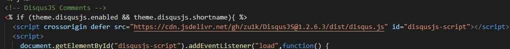

# 加快Github Pages国内访问速度


## 前言

相信不少小伙伴都在使用 Github Pages 提供的免费静态网站托管来搭建自己的博客，但是因为墙的存在和特殊国情，使用 Github Pages 搭建的网站速度普遍不快，因此很多小伙伴只能转战国内付费的服务器和 CDN。

正巧我也在使用 Github Pages 搭建自己的静态博客，正好来说一下我的优化方法。

## 压缩

默认情况下，如果我们查看 Hexo 生成的静态网页源代码，会发现存在大量的空格、空行、注释等无用内容。同样的，如果使用的 hexo 主题没有进行优化，大量的 css 和 js 文件也存在这样的垃圾内容。

如果你在一些大型网站右键查看网页源代码，你会发现他们的 html\js\css 是经过压缩处理的，没有多余的换行和注释，这势必会节省带宽流量和传输时间，提升用户体验。

所以我们优化速度的第一关就是对 Hexo 生成的代码进行压缩。

这里我使用的工具是 gulp

### 安装 gulp

在自己本机安装

```bash
npm install gulp -g
```

为了 Github Action 或其他 CI\CD 平台也能够进行安装，这里推荐

```bash
npm install gulp --save-dev
```

我们还需要一些依赖

```bash
npm install --save-dev \
            gulp-minify-css \
            gulp-babel \
            gulp-uglify \
            gulp-htmlmin \
            gulp-htmlclean \
            gulp-imagemin \
            imagemin-jpegtran \
            imagemin-svgo \
            imagemin-gifsicle \
            imagemin-optipng
```

### 创建配置文件

在博客 hexo 的根目录下，新建 `gulpfile.js` 配置文件

```javascript
var gulp = require("gulp");
var minifycss = require("gulp-minify-css");
var uglify = require("gulp-uglify");
var htmlmin = require("gulp-htmlmin");
var htmlclean = require("gulp-htmlclean");
var imagemin = require("gulp-imagemin");

// 压缩css文件
gulp.task("minify-css", function () {
  return gulp
    .src("./public/**/*.css")
    .pipe(minifycss())
    .pipe(gulp.dest("./public"));
});

// 压缩html
gulp.task("minify-html", function () {
  return gulp
    .src("./public/**/*.html")
    .pipe(htmlclean())
    .pipe(
      htmlmin({
        collapseWhitespace: true,
        collapseBooleanAttributes: true,
        removeComments: true,
        removeEmptyAttributes: true,
        removeScriptTypeAttributes: true,
        removeStyleLinkTypeAttributes: true,
        minifyJS: true,
        minifyCSS: true,
        minifyURLs: true,
        ignoreCustomFragments: [/\{\{[\s\S]*?\}\}/],
      })
    )
    .pipe(gulp.dest("./public"));
});

// 压缩js文件
gulp.task("minify-js", function () {
  return gulp
    .src(["./public/**/*.js", "!./public/js/**/*min.js"])
    .pipe(uglify())
    .pipe(gulp.dest("./public"));
});

// 压缩图片
gulp.task("minify-images", function () {
  return gulp
    .src([
      "./public/**/*.png",
      "./public/**/*.jpg",
      "./public/**/*.gif",
      "./public/**/*.svg",
    ])
    .pipe(
      imagemin([
        imagemin.gifsicle({ interlaced: true }),
        imagemin.mozjpeg({ quality: 75, progressive: true }),
        imagemin.optipng({ optimizationLevel: 5 }),
        imagemin.svgo({
          plugins: [{ removeViewBox: true }, { cleanupIDs: false }],
        }),
      ])
    )
    .pipe(gulp.dest("./public"));
});

gulp.task(
  "default",
  gulp.series(
    gulp.parallel("minify-html", "minify-css", "minify-js", "minify-images")
  )
);
```

### 使用方法

在使用 `hexo g` 生成静态网站后， 运行 `gulp` 进行压缩

## 使用 CDN

如果你查看博客的网络请求内容，你会发现在 html 加载之后，还有一堆小文件等待加载，而这些 css\js\图片文件的加载占据了大部分的网页打开时间。

因为 Github Pages 的延迟巨大，速度极慢，我们更有必要使用国内的 CDN 对这些资源进行分发。

不想使用国内付费的 CDN 服务，我尝试过使用 CloudFlare 进行加速（实质减速）效果不佳，后来发现了 jsDelivr。

jsDelivr 是一家开源免费 CDN，主要是对 npm 包进行 CDN 分发

绝妙的是它还能对 Github 和 Wordpress 进行 CDN 分发

我们可以借助 jsDelivr 的 Github 资源分发 服务来对我们博客中的 css\js\小图片进行加速

> 这是我目前找到的唯一一家在国内有节点并且不需要备案的 CDN 分发服务

这里我就以我使用的主题为例，分享一下我如何使用 jsDelivr 进行 CDN 分发

### 链接格式

jsDelivr 针对 Github 资源有众多 URL 格式

```url
https://cdn.jsdelivr.net/gh/user/repo@version/file
https://cdn.jsdelivr.net/gh/jquery/jquery@3.2.1/dist/jquery.min.js
https://cdn.jsdelivr.net/gh/jquery/jquery@3.2/dist/jquery.min.js
https://cdn.jsdelivr.net/gh/jquery/jquery@3/dist/jquery.min.js
https://cdn.jsdelivr.net/gh/jquery/jquery/dist/jquery.min.js
https://cdn.jsdelivr.net/gh/jquery/jquery@3.2.1/src/core.min.js
https://cdn.jsdelivr.net/gh/jquery/jquery/
```

考虑到 jsDelivr 默认缓存时间是 7 天，如果我们想要修改实时生效而不需要等到缓存过期，最适合的是

```url
https://cdn.jsdelivr.net/gh/jquery/jquery@3.2.1/dist/jquery.min.js

https://cdn.jsdelivr.net/gh/ github用户名 / 库名 @ 版本号或者tag / 路径/文件名
```

我们可以通过打 tag 来访问同一个资源文件的不同版本，而不需要考虑缓存时间

### 替换链接

大部分 hexo 主题并不会对使用到的 js\css\图片\字体 套上 CDN，我们来手动替换

#### css 样式表

大部分 css 样式会在 `head` 标签里面引入，这里的 css 样式表会阻塞页面的渲染，导致打开慢的体验，所以需要特别注意

我将我使用的主题的 style.css \ rtl.css \ disquesjs.css 替换成 jsDelivr，明显提升了等待时间


还有一些其他地方的 css 引入


#### js 脚本

寻找并替换各种调用到的 js 脚本


main.js


disqusjs.js



还有其他的一些地方，不一一列举了

#### 字体

字体需要特别注意，通常情况下比较大，耗时比较长


我使用的主题使用的字体通过 `all.min.css` 引入，因为前面这个 css 样式已经通过 jsDelivr 导入，里面的字体使用的是相对链接，所以字体默认也是通过 jsDelivr 引入了

#### img 小图片

一般是 logo 等资源，根据主题自行替换

> 更新：为了更好的控制版本和决定是否使用 jsDelivr, 可以将这个地方独立出来放到配置文件里

\_config.yml

```yaml
cdn:
  enabled: true
  url: https://cdn.jsdelivr.net/gh/zu1k/blog@0.0.1.2
```

用到的地方

```ejs
<!-- styles -->
<% if (theme.cdn.enabled) { %>
  <link rel="stylesheet" href="<%= theme.cdn.url %>/css/style.css">
<% } else { %>
  <%- css('css/style') %>
<% } %>

其他的地方同样的方法
```

## 加载时文字可见

无论怎样优化，字体加载的时间无法忽略，这段时间的网页文字显示为空，这给用户带来卡顿感

我们必须使字体加载时文字可见，这样才能弥补 github pages 的慢

具体方法是将各 `@font-face` 中 `font-display` 设置为 `swap`, 这样可以在字体未加载完时临时使用系统字体替代，加载完后重新渲染字体


每一个地方都需要改，自己搜索吧

## 使用 DisqusJS

由于众所周知的原因，disqus 被墙了，国内访问不了，而大部分 hexo 网站都使用 disqus 作为评论系统，这导致网页会卡在评论区的加载上，虽然网页已经加载完了，但进度条还在进行，给用户带来慢的感觉。

并且，即使有的用户翻墙能够访问 Disqus，但 Disqus 本身非常笨重，各种 CSS/JS/Font/API 加起来请求不小于 2MB，当 Disqus 加载时，浏览器会在主线程中同步解析、渲染 Disqus，造成卡顿感。

在上网搜索之后，找到了一个替代方案，那就是苏卡卡大佬的 DisqusJS，大家可以根据教程对自己博客的主题进行修改

参考链接：

- https://blog.skk.moe/post/disqusjs/
- https://disqusjs.skk.moe/
- https://github.com/SukkaW/DisqusJS

对于使用的 Disqus API 反代，我自己测试发现苏卡卡大佬提供的速度不太行，不知道是什么原因，所以推荐自己进行搭建，我是用的是 zeit 进行搭建，感觉还不错

> 如果 disqusJS 默认样式不适合自己的主题，推荐 fork 原库进行修改，注意要使用 1.2.6，最新的 master 在懒加载上有点问题

## 使用懒加载

如果图片和评论区随着页面在一开始就加载，势必会拖累网页首次渲染和文字的迅速显示，这里最好的办法是使用懒加载技术

### 图片懒加载

对于图片，我使用了 `hexo-lazyload-image` 这个插件

安装

```bash
npm install hexo-lazyload-image --save
```

配置文件中添加

```bash
lazyload:
  enable: true
  onlypost: false
  loadingImg: https://cdn.jsdelivr.net/gh/zu1k/blog@0.0.1.2/images/loading.png
```

> 顺便给懒加载添加了 cdn 功能，可以替换成 cdn 链接来加速

```bash
npm install hexo-lazyload-image-cdn --save
```

配置文件中添加

```bash
lazyload:
  enable: true
  onlypost: false
  loadingImg: # eg ./images/loading.gif
  cdn:
    enabled: false
    url: https://cdn.com
```

### 评论懒加载

对于评论区，很多情况下用户根本不会划到页面底部（文章写得太烂没人看得下去）。

所以我这里对 disqus 的加载使用懒加载技术，参考 https://blog.skk.moe/post/prevent-disqus-from-slowing-your-site/

我使用的是 disqusJS, 下面给出加载的 js 代码

```javascript
<!-- DisqusJS Comments -->
<% if (theme.disqusjs.enabled && theme.disqusjs.shortname){ %>
  <script crossorigin defer src="https://cdn.jsdelivr.net/gh/zu1k/DisqusJS@1.2.6.3/dist/disqus.js" id="disqusjs-script"></script>
  <script>
    document.getElementById("disqusjs-script").addEventListener("load",function() {
      setTimeout(
        function() {
          function t() {
            var dsqjs = new DisqusJS({
                  shortname: '<%= theme.disqusjs.shortname %>',
                  siteName: '<%= theme.disqusjs.siteName %>',
                  api: '<%= theme.disqusjs.api %>',
                  apikey: '<%= theme.disqusjs.apikey %>',
                  admin: '<%= theme.disqusjs.admin %>',
                  adminLabel: '<%= theme.disqusjs.adminLabel %>'
              });
          }
          var runningOnBrowser = typeof window !== "undefined";
          var isBot = runningOnBrowser && !("onscroll" in window) || typeof navigator !== "undefined" && /(gle|ing|ro|msn)bot|crawl|spider|yand|duckgo/i.test(navigator.userAgent);
          var supportsIntersectionObserver = runningOnBrowser && "IntersectionObserver" in window;
          if (!isBot && supportsIntersectionObserver) {
              var disqus_observer = new IntersectionObserver(function(entries) {
                if (entries[0].isIntersecting) {
                  t();
                  disqus_observer.disconnect();
                }
              }, { threshold: [0] });
              disqus_observer.observe(document.getElementById('disqus_thread'));
          } else {
            t();
          }
      }, 1);
    },!0
  );
  </script>
<% } %>
```

## 终极大招

如果经过上面的优化，你还对博客的加载速度不满意，那一定是 github pages 服务器在美国的原因，200+ms 的延迟导致首字节返回时间不短

其实支持通过 Github 仓库代码进行构建，部署为静态网站的平台不值 github pages 一家，我使用过的比较好的是 `zeit.co` ， 国内访问走的是台湾的 gcp 节点，延迟低速度快，推荐

具体使用方法非常简单，自行摸索吧

> 更新: 刚知道，如果更新太快的话，zeit 会暂停构建部署的
>
> You are pushing commits at a very fast pace (across the whole organization).  
> Due to that, we cannot deploy the commit e80751b.
>
> You can try again later or upgrade your plan.

## 辅助优化

使用谷歌提供的 [Pagespeed Insights](https://developers.google.com/speed/pagespeed/insights/) 工具分析网页加载并根据建议进行优化

