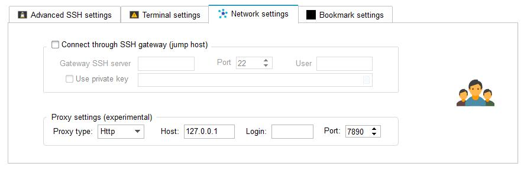

# 使用GlobalSSH服务加速境外服务器ssh访问


> ### UCloud已经对加速IP进行限制，本文中的方法即时失效   
> 
> 通知内容如下：   
> 尊敬的UCloud用户，您好！   
> GlobalSSH产品即日起将暂时限制服务器IP地址范围，   
> 仅允许添加UCloud平台上的IP地址，已创建的资源仍然可继续使用。    
> GlobalSSH版本与功能支持将持续更新，敬请关注。   

由于众所周知的原因，很多国外的服务器在国内的访问效果很差，特别是国内比较热门的廉价服务器例如 Vultr 就经常被墙直接无法访问

通常情况下我会使用ssr等代理服务进行中转，在我经常使用的 MobaXterm 中设置起来也非常方便



但是这种方法有两大劣势：

1. 如果科学上网服务器不稳定经常断流就会导致ssh连接断开
2. 部分客户端不支持设置http或者socks代理

## GlobalSSH

今天发现了一个免费的加速服务，非常方便，推荐给需要的人

这就是 UCloud 免费提供的 GlobalSSH 加速服务

官网链接： https://console.ucloud.cn/upathx/globalssh

官方文档： https://docs.ucloud.cn/pathx/globalssh

这项服务目前是免费的，~~也不需要进行实名认证~~ 现在需要实名认证才能用了，可以说是非常良心了，经过我的试用，访问速度和稳定性非常不错

支持ssh和rdp远程桌面，猜测有一些其他的服务可以加速，因为是针对端口加速的，但是如果滥用的话可能被封禁

在创建的时候只需要输入需要加速的国外服务器的ip和服务端口号，选择一个离服务器近的接入点


创建之后会提供一个域名，可以将自己的域名CNAME解析到提供的域名上方便记忆，UCLOUD可以准确识别到是访问哪一台服务器

在我们使用的客户端上只需要用提供的加速域名和原服务端口号就可以了

## 注意事项

1. 自产品实例创建之日起，7日内单个实例累计出向流量小于2MB，加速功能将被停用，所以一开始先多用点吧
2. 每个源IP只能加速一个端口
3. 加速流量上限官方未注明，滥用的话会被封

## 妙用

众所周知，github在国内的访问速度很慢，有时候clone一个库不得不忍受十几k几十k每秒的速度

而git是可以用ssh协议的，所以我们只需要从 https://api.github.com/meta 找到github使用的ip，通过GlobalSSH加速22端口，然后将自己的域名解析到加速的ip，最后使用自己的域名clone就行了

经过我的尝试效果还不错，可以跑到10Mbps

我用的域名为 `githubssh.xyz` ，大家可以拿去用，使用方法如下：

```bash
原命令
git clone git@github.com:moby/moby.git

替换后
git clone git@githubssh.xyz:moby/moby.git
```

为了能够自动更新ip，我写了一个程序，每天会检查github新的ip，创建新的globalssh，然后自动解析到域名githubssh.xyz上，由cloudflare进行DNS层面的负载均衡

开源地址为： https://github.com/zu1k/globalssh4github

同时为了方便，改了一个插件： https://chrome.google.com/webstore/detail/github%E5%8A%A0%E9%80%9F/kejahdakjmkfddgnifodfnpcklckjjpo

