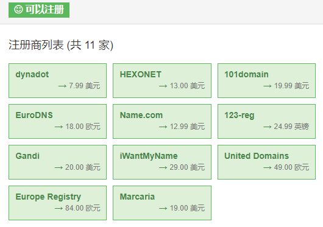
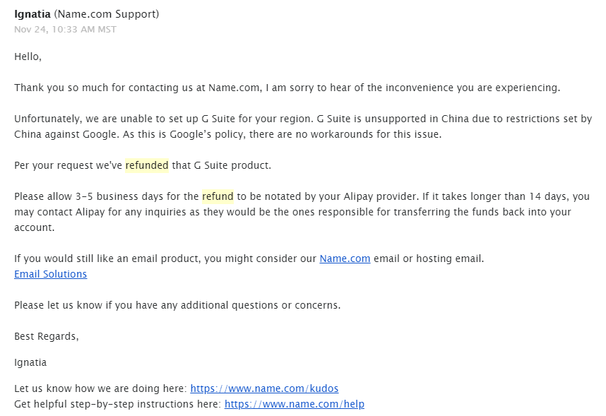
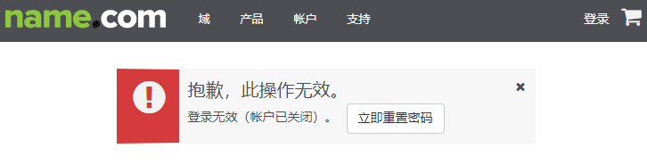
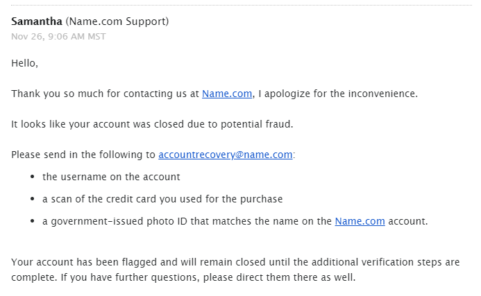
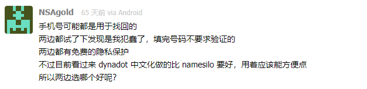
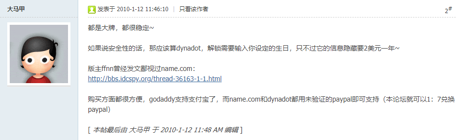
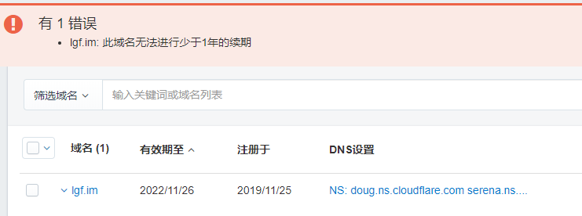

# 使用Name的一次糟糕的体验

这个事情发生在一个周以内，体验极其糟糕，特此记录一下。

## 事情起因

大半夜突发奇想想要买一个im的域名，通过域名比价网站Namebeta进行搜索，发现里面只有一个是我之前听说过的，Name.com在V2EX上经常看到有人提及和推荐，也就没有考虑价格最低的dynadot，直接注册了Name.com账号。

登录Name网站后购买了lgf.im这个域名，续了5年，一次只能续期一年，分4次续上的。

想要使用这个域名做一个域名邮箱，不想自己搭建，就直接搜索免费的企业邮。

之前有使用过腾讯企业邮、网易企业邮、阿里云企业邮箱，用的都是免费版，体验最好的是腾讯企业邮，还支持域名下所有邮件转发到指定邮箱，如此就可以一个邮箱账号掌管全局了。

注册并登录上之后才发现，腾讯企业邮新版中这个功能竟然变成了收费功能，难受，收费价格还这么贵。

便上网搜索好用的企业邮，再比较各类企业邮之后，就想直接上付费的G Suite，又恰巧Name.com又半价的G Suite可以购买，便想直接在Name购买。

支付宝付款，很快便支付成功，然后进入G Suite商品设置界面，需要捆绑上G Suite需要使用的域名，这里选择了刚刚购买的域名，但是提示profile不能绑定该域名。具体提示词我也忘记了，当时没有截图。

既然不能用，那我就申请退款吧，就发了一个申请退款G Suite的工单，工单在当天半夜1点回复了我。工单中说明G Suite不支持中国，并且可以退款，当天晚不到2点钱就退回了支付宝，退款速度很快。

第二天我就想，既然中国区的账号信息无法使用G Suite，那我改成美国的身份应该就可以了吧，所以找出我之前使用过的一个美国身份，修改账号信息。

然后重新购买了G Suite，这一次成功绑定，当天上午就将各种配置修改好，成功使用G Suite了。

本以为本次的购物就这么愉快的结束了，域名续了5年，G Suite也点了自动信用卡续费，可谁知坏消息当天中午就发生了。

## 域名被删强制退款

中午，接连收到了信用卡的短信通知和支付宝的通知推送，之前购买和续费域名的钱被退回来了。我就感觉莫名其妙，赶紧登陆账号查看发生了什么。

刚购买的域名被删了，连个邮件通知都没有，直接删域名退款。。。

我以为是昨天的申请G Suite退款的工单，工作人员搞错了，错误的把域名也给我退款了，赶紧发了一个工单进行询问。

等了好久也没有回复，想着晚上在看看吧。

## 账号被封

晚上回宿舍想要看一下工单进度，就发现登录不上name账号了。

点击立即重置密码发现并没有收到重置邮件，上网搜索相关信息后怀疑账号被封了。

第二天上午，我收到了工单的回复，提示我需要再次验证账号身份。

WTF??

因为提了工单，所以就要锁我账号？就要更多我的个人隐私？？什么鬼！！

没办法，G Suite还没到期，后面可能还要用到name.com，所以就按照他的要求上传了各种信息。

第二天晚上，收到了最终回复，账号不予解封，白嫖我个人信息，气死了。

## 后续

因为是正式开始使用dynadot了，就需要好好了解一下这个域名购买网站。

上网对其进行了搜索，后悔一开始没有选择dynadot，看各种评价，发现口碑很好，主要还很便宜。

据我自己的使用体验，只要国家设置成中国，语言中文，币种选择人民币，dynadot是支持支付宝和微信支付的，非常方便。

## 后记

dynadot一开始买的时候最多选3年，我想要一次性续5年，可是选择续费后返回一个错误，难不成最多只能续3年？？

先不管了，反正开了自动续费，还有3年，等到期了再说。

## 总结

在Name的这次体验让我感到极为不友好，体验炒鸡糟糕，烦！

但是反省自己，也不是没有错，审查归根到底还是因为我使用了虚假的美国身份。

现在越来越多的国外厂商针对中国人的审查变得越来越严，我认为这极大一部分原因是国内羊毛党太多，他们真的被薅怕了，迫不得已加强审查。

> 后来我才听同学说，近期Name有活动，可以撸域名，沃日，难不成审查他们的虚假账号我倒霉的中枪了?

