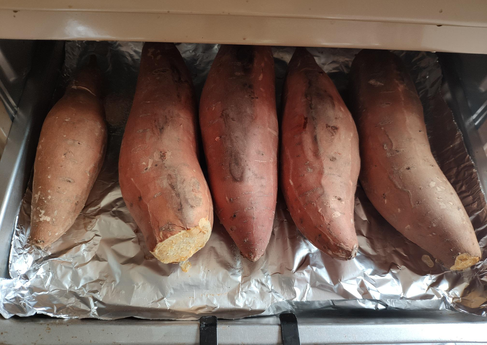

# 烤红薯

> 这应该是我第一篇记录生活的博文吧，之前一直是写一些学习、技术相关的文章，总感觉博客不应该只记录这些东西，那就开始吧

妈妈从网上买了几斤红薯，今天突然说想吃，那就用烤箱烤一下吧

## 准备

烤盘铺上锡纸（哑光面接触食物），红薯洗净不去皮，均匀的摆放到烤盘上

烤箱230度预热10分钟后就可以将烤盘放入了

## 第一波

230度先烤30分钟，呼叫小爱：“小爱同学，30分钟后叫我”

30分钟不到（大约20多分钟吧）就闻到红薯的香气飘出来了，香啊

30分钟后打开烤箱，用夹子夹着给每个红薯翻个个

烤了半个小时的红薯朝上的那面有点软，但是没有怎么变色，接触锡纸的一面有点变黑了，焦感出来了

翻完个后拍了三张照片，可以看到整体还是不错的，火候还不到，有的地方已经流出油来了

## 第二波

鉴于红薯个比较大，翻个后时间增加到45分钟，接着烤

中途没忍住，打开拍了一张照片，流了很多油啊，接触到烤盘发出滋滋的响声，很是诱人

## 出炉

时间到，啥也不说了，直接看图吧

超级好吃，超级甜，超级香

## 补充

这次因为是第一次烤，烤的时间稍微有点长，流出来太多油浪费了，还有一些油都烤糊了，下次会缩短一点时间

