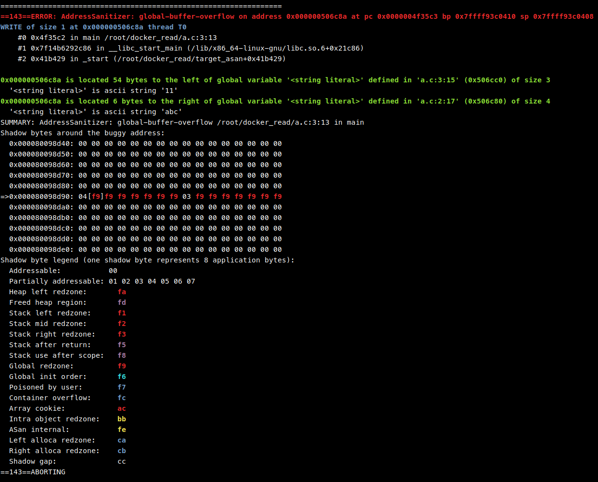
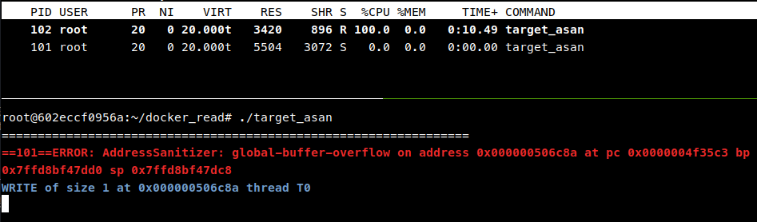

# 从 ASAN Stuck 到 Open Files Limit


[Sanitizers](https://github.com/google/sanitizers) 是好东西，可以帮助程序员检测错误并提供详细的错误报告。但前两天我遇到了一个问题，在我实验室主机的 Docker 容器中，AddressSanitizer 输出几行 Error 概述信息后，无法输出调用堆栈信息以及后续内容，程序会卡在这里，并且一个子进程会占满一个 CPU 核心。这件事我花了两天时间来排查，最终确定竟然是由于打开文件数限制设置太大导致的。请听我道来。

## 发现问题

我准备了一个最小的 POC，用来重现本次事件的整个流程。以下是一个简单的 c 程序，如果直接编译运行会出现 SegmentFault，因为出现了越界写。

```c
void main() {
    char *str = "abc";
    str[10] = 'z';
}
```

使用 clang 编译并开启 AddressSanitizer: `clang -g -fsanitize=address -fno-omit-frame-pointer -o target_asan poc.c`

正常情况下运行应该很快输出调用堆栈信息，如图：



而这在我的 Docker 容器中就会卡住，通过 `top` 命令可以看到一个子进程占满一个 CPU 核心：



我一开始以为程序就这样进入死循环了，谁知道等了几分钟竟然也输出了结果。

于是我开始查资料，在 [LLVM 文档](https://clang.llvm.org/docs/AddressSanitizer.html#symbolizing-the-reports) 中提到可以通过设置环境变量 `ASAN_OPTIONS=symbolize=0` 来关闭 symbolize 流程。实验发现关闭符号解析后可以顺利输出后续内容。


一开始我以为是符号解析器出 bug 了，尝试切换符号解析器，将默认的 `llvm-symbolizer` 替换成 GNU `addr2line`。

`ASAN_SYMBOLIZER_PATH=/usr/bin/addr2line ./target_asan`


仍然卡住，于是我怀疑不是 `llvm-symbolizer` 的问题，感觉有可能是系统内核的问题，或者因为最新版 Docker 与内核冲突了？具体也不清楚，反正没有头绪。

当我把程序拷贝到宿主机上运行时，这个问题就莫名其妙的消失了。我将容器打包拷贝到同学的 Ubuntu 下，无法复现问题，也是顺利输出。我还尝试了将 Host 内核降级到 5.15，将 `Docker`/`Containerd`/`runc` 版本降级到与同学 Ubuntu 上相同的版本，均无法解决问题。

后面通过 strace 发现 AddressSanitizer 卡在 read 系统调用上，并通过上下文猜到与 `llvm-symbolizer` 交互的流程。


这里可以看到 AddressSanitizer 通过 fork 子进程，然后通过 pipe 的方式与子进程通讯，写 `CODE "binary_path" offset\n` 来请求查询 `binary` 的 `offset` 位置对应的符号信息，如果查询成功会返回源代码、行号、函数名等符号信息。

我尝试手动运行 llvm-symbolizer，正常输出没有任何问题。

但是这个时候我是一筹莫展，睡觉前在 [Twitter 上求助](https://twitter.com/zu1k_/status/1668635289433292885)，看看有没有人也遇到过这个问题。

## 深入

根据网友 [whsloef 的回复](https://twitter.com/whsloef/status/1668636143863369729)，我打印了阻塞的进程的调用栈，跟我通过 strace 得到的结论相同，是卡 read 系统调用了。


然后根据网友 [Ningcong Chen 回复](https://twitter.com/JXQNHZr1yUAj5Be/status/1668684560195010561) 的一个历史 issue，我尝试用 gdb 来附加阻塞进程。（我之前考虑过给占用 100% 的进程做 profile，看看到底是什么行为占满 CPU，但考虑 AddressSanitizer 是 clang 注入的，不清楚好不好做，于是就没做）


附加主进程后，发现卡在 `internal_read`，推测是子进程没有返回。


附加子进程，发现卡在一个 for 循环上，通过调用栈信息，从 GitHub 上下载了源码，开始分析原因。

通过 LLVM compiler-rt 源码，定位到 [`compiler-rt/lib/sanitizer_common/sanitizer_posix_libcdep.cpp#L465`](https://github.com/llvm/llvm-project/blob/f9d0bf06319203a8cbb47d89c2f39d2c782f3887/compiler-rt/lib/sanitizer_common/sanitizer_posix_libcdep.cpp#L465)，我把 `StartSubprocess` 简化为以下流程：

```cpp
pid_t StartSubprocess(const char *program, const char *const argv[],
                      const char *const envp[], fd_t stdin_fd, fd_t stdout_fd,
                      fd_t stderr_fd) {
  
  int pid = internal_fork();

  if (pid == 0) {
    for (int fd = sysconf(_SC_OPEN_MAX); fd > 2; fd--) internal_close(fd);

    internal_execve(program, const_cast<char **>(&argv[0]),
                    const_cast<char *const *>(envp));
    internal__exit(1);
  }

  return pid;
}
```

这是一个典型的启动子进程的方法，先 `fork`，然后在子进程中关闭不必要的文件描述符，最后通过 `execve` 启动目标程序。

但 LLVM 这里通过 `int fd = sysconf(_SC_OPEN_MAX)` 获取最大文件打开数，然后循环关闭，在文件打开数限制很大的情况下就会进行很多不必要的系统调用，从而导致耗时又占 CPU，最终导致我出现我上面那种假死的情况，实际上进程正在忙着关闭不存在的文件描述符。

通过在容器内运行 `ulimit -n` 发现容器内的文件描述符限制是 `1073741816`，而对比宿主机的限制 `1024`，这种差异就是我将程序拷贝到宿主机就无法复线问题的重要原因。

我尝试在运行容器的时候加一个打开文件数限制 `--ulimit nofile=1024:1024`，问题顺利解决。

原来网友 [lightning1141 的回复](https://twitter.com/lightning1141/status/1668726282811580416) 是让我看文件打开数是不是太大的意思啊，我还以为是看看够不够用呢。我之前一直以为这个东西设置的越大越好的，我 too naive too simple.

## 思考

但既然宿主机限制是 `1024`，那为什么在 Docker 容器里的限制却有 `1073741816`？

我根据经验查询了以下文件，发现打开文件数均为默认，并未指定特定数值：

- `/etc/security/limits.conf`
- `/etc/systemd/system.conf`
- `/etc/systemd/user.conf`

然后查看 docker 相关限制，因为由 systemd 管理，所以查看以下文件：

- `/usr/lib/systemd/system/docker.service`
- `/usr/lib/systemd/system/containerd.service`

在服务文件中均指定 `LimitNOFILE=infinity`，由此导致打开文件数不受限制，通过 `cat /proc/sys/fs/nr_open` 查看内核默认的进程打开文件数限制，发现是 `1073741816`。而在同学的 ubuntu 机器上 nr_open 是 `1048576`。

这种发行版的细微差别导致的问题真是难以排查啊！

## 解决方案

### 修改 Containerd 文件描述符限制

修改 `/usr/lib/systemd/system/containerd.service`

```
[Service]                                                                                                                     
LimitNOFILE=1048576
```

无需修改 `/usr/lib/systemd/system/docker.service`

或者在启动容器的时候添加限制 `--ulimit nofile=1048576:1048576`：

`docker run -it --ulimit nofile=1048576:1048576 ubuntu:18.04 /bin/bash`

### 修改 LLVM 中逻辑

可以修改 LLVM 源码，使用 `close_range` 或者 `closefrom` 系统调用替换 `close`.

- `close_range` Linux kernel 5.9 增加, 在 BSD 也可用
- `closefrom` FreeBSD 8.0 引入, 在 Linux 上需要链接 `libbsd`

可惜的是这两个都不是 POSIX 规范定义的系统调用，不过我认为这后面会成为主流的。

只改了 [Linux 的版本](https://github.com/zu1k/llvm-project/commit/ba3ac3c9e636b4f32590cda4f44ccf76cb84550d)，并且需要 Kernel 5.9 以上。

## 后续

在 GitHub 上相应仓库提起了 issue，等待改进。虽然自己改了一个 Linux 的可以用了，但是考虑到 LLVM 需要保证兼容性，这里也不敢去提 PR，毕竟要求 Linux 5.9 以上版本可不是一个兼容性好的方案。（我在 ubuntu 18.04 的 docker 里就没办法编译通过，`unistd.h` 里没有定义 `#define __NR_close_range 436`）

- https://github.com/llvm/llvm-project/issues/63297
- https://github.com/google/sanitizers/issues/1662
- https://github.com/google/sanitizers/issues/1477

> 突然想到了一个之前别人问的一个问题：[当我运行 >500 个线程时代理开始失败](https://github.com/zu1k/blog/discussions/53#discussioncomment-4808529)
> 
> 既然很多发行版单进程最大文件打开数是 1024，那这个问题就好推测了。这个代理程序对每一个连接需要打开两个文件描述符，一进一出嘛，那并发上不了 500，就是因为 1024 太小了。改一下就能解决。

