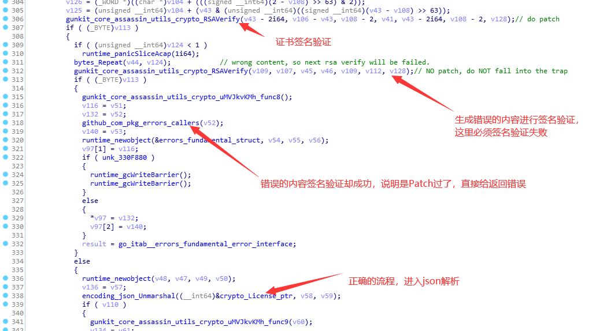
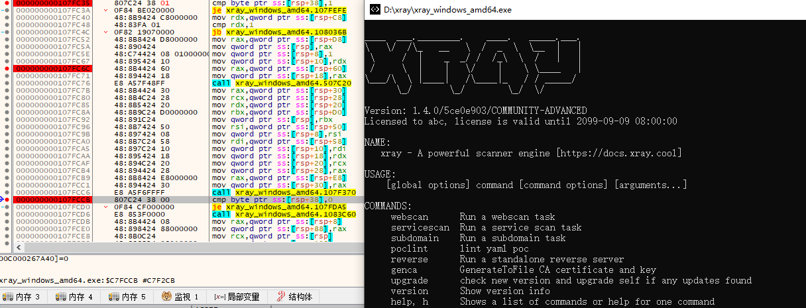
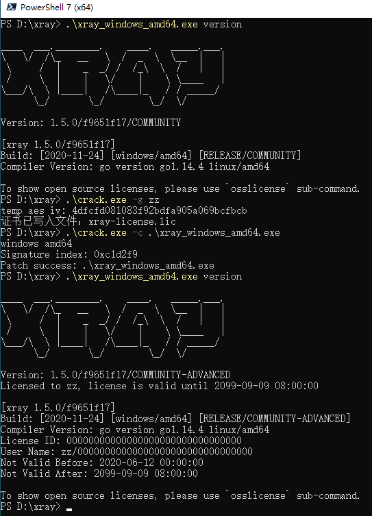

# xray社区高级版破解


> 首先感谢 长亭科技 提供 xray 这款非常方便非常好用的安全工具  
> 俗话说：没有人破解的工具不是好工具  
> 根据没有任何数据支持的统计，大部分安全研究人员使用的安全工具都是盗版  
> 包括但不限于： IDA \ JEB \ BurpSuite \ Vmware

前几天长亭官方有个活动，可以领 2 个月的 xray 社区高级版证书，正好趁这个机会逆向分析了一下 xray 的证书算法，写了一个证书生成器

因为 xray 证书用到了 rsa 算法，所以需要替换 xray 程序中的公钥，将该功能也集成在工具中了

## 工具使用

### 查看帮助

使用 `-h` 查看帮助

```shell
PS > .\xray-cracker -h
破解xray高级版证书，使用 -h 参数查看使用帮助

Usage of xray-cracker:
  -c string
        替换xray程序内置公钥，需要指定xray程序文件路径
  -g string
        生成一个永久license，需要指定用户名
  -p string
        解析官方证书，需要指定证书路径
```

### 生成证书

使用 `-g username` 生成永久证书

```shell
PS > .\xray-cracker -g "我叫啥"
破解xray高级版证书，使用 -h 参数查看使用帮助

证书已写入文件：xray-license.lic
```

### 破解 xray

使用 `-c path-to-xray` 修改 xray 内置公钥

```shell
PS > .\xray-cracker -c .\xray_windows_amd64.exe
破解xray高级版证书，使用 -h 参数查看使用帮助

public key index: 16741321
文件写入成功： .\xray_windows_amd64.exe
```

> 工具虽然是 windows 平台下运行，但是照样可以破解其他平台 xray  
> 目前 xray 最新版是 1.0.0，现在全平台全版本通杀

## 破解效果

使用修改版 xray 和永久证书后，效果如下

```shell
PS > .\xray_windows_amd64.exe version

 __   __  _____              __     __
 \ \ / / |  __ \      /\     \ \   / /
  \ V /  | |__) |    /  \     \ \_/ /
   > <   |  _  /    / /\ \     \   /
  / . \  | | \ \   / ____ \     | |
 /_/ \_\ |_|  \_\ /_/    \_\    |_|


Version: 1.0.0/62161168/COMMUNITY-ADVANCED
Licensed to 我叫啥, license is valid until 2099-09-09 08:00:00

[xray 1.0.0/62161168]
Build: [2020-06-13] [windows/amd64] [RELEASE/COMMUNITY-ADVANCED]
Compiler Version: go version go1.14.1 linux/amd64
License ID: 00000000000000000000000000000000
User Name: 我叫啥/00000000000000000000000000000000
Not Valid Before: 2020-06-12 00:00:00
Not Valid After: 2099-09-09 08:00:00
```

## 部分细节

> 距离博文发布已经过了快一个月了，补充一点点细节信息，希望能够帮助到部分研究学习的同学

这里只给出使用的关键函数和关键流程，一些重要参数细节需要自己探索，可以动态单步调试获得

### AES 解密

```go
decode_data, err := base64.StdEncoding.DecodeString(licenseString)
if err != nil {
  panic(err)
}

aesDecData, err := AesCBCDecryptAndUnPad(decode_data[17:])
if err != nil {
  panic(err)
}

licensePlainJsonBytes := aesDecData[0x102:]
```

### RSA 签名验证

```go
sum := sha256.Sum256(licensePlainJsonBytes)
err = rsa.VerifyPSS(pubKey, crypto.SHA256, sum[:], aesDecData[2:0x102], nil)
```

## 2020年8月27日 补充

xray 官方在 1.3.0 版本中更换了授权验证机制，所以破解仅支持到 1.2.0 版本，本文使用代码现在开源： https://github.com/zu1k/xray-crack

## 2020年9月30日 补充

前几天有大佬私发我一个 License，我就又对证书算法研究了一下

相关代码也已经更新到 github 了

### 证书生成

证书生成验证整体的思路没有大的改动，还是先 AES 解密，然后 RSA 签名验证，只是前后增加了两处简单的变换

在解密前有一个简单的交换，开始和最后的两个两个没有参与运算（开始第一个字节是证书版本号）

```golang
right := len(base64DecodeData) - 1
for l := 1; l < right; l++ {
  r := right - l
  if l >= r {
    break
  }
  base64DecodeData[l], base64DecodeData[r] = base64DecodeData[r], base64DecodeData[l]
}
```

然后进行 aes 解密，密钥是写死的，IV 是附加在证书里面的，刚刚的变换结束后，除去第一个字节是版本号，紧接着的 16 个字节是 AES 的 IV

```golang
aesDecData, err := Decrypt(base64DecodeData[17:], base64DecodeData[1:17])
```

AES 解密后就会遇到另一个变换，是简单的异或处理

```golang
for i := 0; i < len(aesDecData); i++ {
  aesDecData[i] = aesDecData[i] ^ 0x44
}
```

然后后面的部分就跟之前一样了

### 公钥

在新的版本中，RSA 的公钥被加密处理了，在运行的时候解密，这样做可以防止我们通过简单的公钥替换通杀所有的版本和平台

通过逆向发现，解密函数有二百多个局部变量，先是变量之间互相交换，然后两两进行加、减、异或等操作来还原公钥信息

我推测是用程序生成的代码，然后那生成的代码编译的，这样可以在每一次编译的时候重新生成一下代码，增加我们破解的时间

从这一方面出发，我只能变换一下思路，不能去硬刚

Golang 中 RSA 签名验证代码如下：

```golang
err := rsa.VerifyPSS(pubKey, crypto.SHA256, sum[:], aesDecData[2:0x102], nil)
if err != nil {
  fmt.Println("签名验证 失败")
} else {
  fmt.Println("签名验证 成功")
}
```

很明显，是通过判断返回值是否为空来确定签名验证是否成功的，在汇编中一般为`test eax,eax`，然后`setnz`或者`setz`，所以我可以修改这里

但是这种方法我只能手工修改，目前没有实现用程序来自动化

> 主要是无法确定应该修改哪一个地方，因为出现了不止一次，一个特征是调用 VerifyPSS 的那个 Call，可以尝试自己解析 pclntab 段，从中还原符号表找到这个验证函数的入口，然后找搜索关键 Call，再在这个 call 后面两三个汇编处找 setnz 或者 setz 进行修改

## 2020年10月4日 补充

感谢 @Lz1y 大佬在 PR#3 中提供的思路，现在已能够自动patch非arm版本的xray二进制了

## 2020年10月5日 补充

上个版本直接全部进行替换，会导致xray有些功能出现错误，这里进行了修复

增加了 arm 版的自动patch，现在能够全版本破解了

## 2020年11月6号晚 补充

刚刚发现又发新版了，发现已有的程序无法完成patch了，分析发现新的1.4虽然没有修改证书生成算法，但是针对我上面的patch进行了检查

我前面是对签名验证返回值进行修改，如果签名验证失败就改成验证成功。1.4增加了一次签名验证，验证的内容是错误的，必然会验证失败，如果patch还是修改为验证成功就落入了陷阱



思路是对的，但是问题不是在这里，我并没有对RSAVerify本身进行patch，而是patch函数返回后对结果的判断，并且只修改了一处判断，并没有对所有判断都进行修改，所以即使有检查也没有造成影响

新版本因为换用了Golang 1.14，是go的版本差异导致的patch问题（汇编不同了），目前完成了amd64平台的自动patch，其他的平台等大佬PR



## 2020年11月11日 补充

感谢 [@nszy007](https://github.com/nszy007) 提供[剩余平台的patch](https://github.com/zu1k/comment/issues/4#issuecomment-725222928)

## 2020年11月11日 下午16点 补充

收到 Chaitin 人员的要求，已删除相关源代码

## 2020年11月18日 补充


思路不变，不要再给我发邮件要破解版和代码了

## 2020年11月24日 补充



证书算法没有任何修改


前段时间长亭的小姐姐跟我说有人通过破解xray盈利，那时候我还不太信，真有人花钱买破解版？

前几天算是见到了


希望不要再有人联系我要（买）破解代码和工具了，我是不会干这种事的


